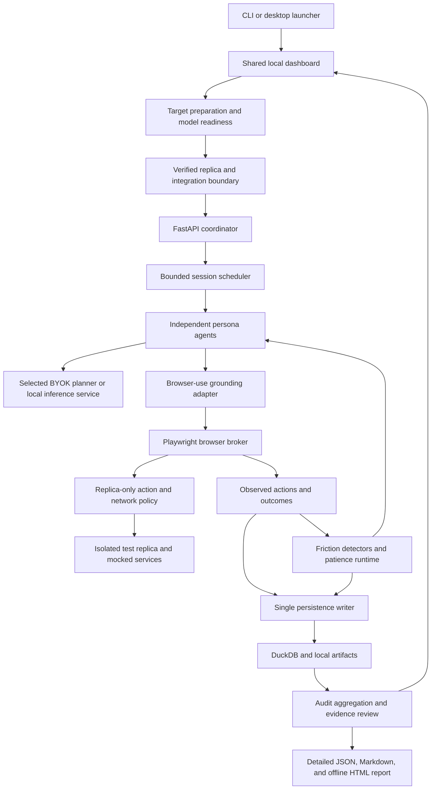

# FrictionLab — Phase-by-Phase Implementation Plan

**Product:** Autonomous, multi-agent behavioral testing for staging web applications.  
**Architecture:** Python application running locally, with an interactive dashboard and exportable reports.  
**Cost constraint:** Local execution with no required subscription or cloud compute. Agent testing requires a configured AI model: the user's own eligible API key or an explicitly configured local model. Preserve a no-paid-API local option; paid providers require explicit opt-in and spending limits.
**Document date:** October 6, 2026 (Asia/Kuala_Lumpur).
**Status:** Phases 0–14 are complete for their declared fixture, offline, Windows desktop and public distribution gates. Runtime execution remains local. Phase 15 preparation exists, but user-supplied repo/replica execution remains blocked pending its independent isolation gate. Phase 16's Morpheus connection and scripted fixture-planner/report gates passed; prepared local-planner selection and one real-model Linux dashboard journey are verified. Phase 17's offline and shared fixture-agent/package gates passed; broader user-supplied application onboarding and interactive pilots remain open. Phase 18 remains the final, deferred hosted-deployment phase. Existing static checks, API connection checks and fixture results do not establish completion of the primary agent workflow. The public source, downloads and static landing page do not host assessments or user data.

## 1. Intended outcome

A product team registers an isolated test replica of its website, defines an open-ended user goal, and selects behavioral profiles. Independent browser agents attempt the goal, encounter interface friction, and either complete the journey or stop with a recorded reason. After execution, the product reviews the saved evidence and automatically produces a detailed report containing screenshots, action timelines, synthetic interaction heatmaps, and evidence-linked recommendations.

The first release should support:

- One staging application at a time.
- Three configurable profiles: impatient mobile shopper, keyboard user with low-vision requirements, and skeptical enterprise evaluator.
- Three representative journeys per application.
- One or two simultaneous browser sessions, with larger cohorts queued.
- Local inference, DuckDB storage, a Streamlit dashboard, and static report export.
- Matched before/after runs to assess interface changes.

Treat explanations as synthetic UX hypotheses. Agent mistakes, execution errors, and provider failures must remain distinguishable from interface failures and simulated abandonment.

### Primary product workflow — AI agents act as website users

**Product clarification — October 5, 2026:** FrictionLab's primary experience is autonomous behavioral testing. AI agents observe the interface, choose actions, click, type, navigate and attempt user goals under explicit persona constraints. AI must drive browser decisions during execution; adding AI prose to a static scan does not satisfy this workflow.

Both entry points must reach the same local run workspace and engine:

| Entry point | Intended user flow |
|---|---|
| Terminal | Install and run `uv run frictionlab start` → open the localhost dashboard → connect the user's AI provider/model or configured local model → provide a repository/local source copy or isolated website → prepare and validate the test environment → choose goals and personas → run agents → review/export the detailed report |
| Windows desktop | Download/extract and open `FrictionLab.exe` → connect the user's AI provider/model or configured local model → start/open the local dashboard → follow the same target, environment, goal, agent and report flow |

The current CLI/desktop shares a fixture-agent and static assessment workspace. Arbitrary repo/website agent execution remains unavailable. The complete user-supplied application flow above is still planned.

- **AI user testing (primary):** Requires a working planner model and verified interactive environment before execution. BYOK is the default onboarding path; a configured local model is an alternative. A missing key alone is acceptable only when the selected local model is ready. If no planner is available, block the agent run with actionable setup guidance and a prerequisite report.
- **Static assessment (supporting):** Keep URL/snapshot structural, accessibility and viewport checks as a separately labeled mode. It works without AI; optional AI advice remains available. Static evidence cannot establish task completion, cognitive friction or agent abandonment.
- **Repository input:** Accept a repo URL or local source copy as setup input, not as a directly browsable target. Resolve and record the revision; prepare a separate disposable workspace, identify supported build/start requirements, configure synthetic data and mocked integrations, and run the application behind the verified boundary. Show proposed build/start steps before running user-supplied code; never reuse production secrets or overwrite the user's checkout. Unsupported/private/multi-service projects need actionable setup guidance and must remain blocked until prerequisites are supplied.
- **Website input:** Accept a verified isolated runnable website/replica and its environment policy. A production URL alone cannot establish backend/data/integration isolation; guide the user to supply a replica or explicitly select static assessment. Do not automatically crawl production or silently downgrade an agent run to a static scan.
- **Goals and personas:** Let users define tasks such as finding a product, completing a test checkout or requesting a demo; select profiles, devices, test accounts, success criteria and per-run budgets. Provide templates without inventing business outcomes from a URL.
- **Execution and evidence:** Show agent progress, actions, screenshots, milestones and stop/cancel controls. Use the model to decide each next action from bounded browser observations and journey memory. Record model/provider failures separately from observed interface friction.
- **Output:** Automatically finalize the detailed report required by requirement B. Distinguish observed facts from synthetic interpretation, identify the mode and actual coverage, and include individual journeys, completion/abandonment outcomes, evidence, recommendations and limitations. Scores alone are insufficient.

**Definition of done:** A new user can complete both CLI and desktop onboarding, connect a qualified planner, prepare a supported user-supplied repo or verified replica, run multiple task-driven personas and review/export their evidence-backed reports. Healthy and seeded-defect builds demonstrate observed successful and failed journeys with zero live-service sentinel traffic. Static-only acceptance or a single provider connection request cannot close this gate.

### Mandatory requirement A — Protect the deployed website

**Product contract:** Test execution and report review must not change the deployed website's code, configuration, real user data, transactions, or integrations, or send cohort traffic to its live services.

Strict protection requires an isolated replica or offline replay. Browsing the deployed website itself creates requests, logs, analytics events, and potentially state changes; request interception cannot undo an effect that already reached a server. Therefore, a live deployed URL is not an eligible execution target for this product's strict mode. A hostname containing `staging` is not sufficient evidence of isolation.

| Area | Required protection |
|---|---|
| Application | Run the same application build in a separate local or dedicated test deployment; record the build identifier |
| Data | Use synthetic or sanitized copied data in a separate database/tenant; no production credentials or shared live accounts |
| Integrations | Replace payments, email, SMS, webhooks, inventory, analytics, and other external effects with local mocks or isolated test services |
| Network | Deny live application/API origins and unknown destinations; allow only declared replica services through a controlled egress boundary |
| Browser | Start fresh contexts; disable service workers in the initial strict implementation; enforce policy on navigations, redirects, frames, fetches, beacons, and WebSocket connections |
| Actions | Permit state changes only inside disposable test data; block purchases, deletion, invitations, or external dispatch outside that boundary |
| Traffic | Apply global concurrency and request-rate limits, step/runtime ceilings, and an emergency stop to protect the replica and shared infrastructure |
| Instrumentation | Keep observation scripts and screenshot marks temporary within the agent browser; remove them before clean evidence capture; never install or persist changes into the deployed application |
| Remediation | Produce advice for review; never automatically change source code or deploy fixes |
| Review | Generate reports and play back saved evidence offline; opening a report must not reconnect to the website |

Create an `EnvironmentPolicy` manifest containing replica origins and dependencies, blocked live origins, data-isolation evidence, test credential references, integration mocks, network rules, cleanup scope, and traffic limits. Validate it before any application navigation. If isolation cannot be established, block execution and generate a report explaining the unmet prerequisites. Do not probe the live application to infer safety.

Use Playwright policy hooks plus a container/network boundary or controlled proxy. Browser interception alone is insufficient. A replay bundle must also block external resources, sanitize scripts, and use only local fixtures. Required downloads or sample exports are setup inputs supplied separately; a run must not crawl production to create its own replica.

**Acceptance:** Seed the fixture with attempted live API calls, redirects, beacons, service-worker registration, and WebSocket connections. At the phase boundary, confirm the controlled live-service sentinel receives zero requests, its data remains unchanged, and blocked attempts appear in the report. This proves protection for the tested boundary; deployment isolation remains an explicit prerequisite.

### Mandatory requirement B — Detailed report after execution and review

Every terminal run, including completed, failed, cancelled, interrupted, or blocked runs, must automatically create a report. A short outcome summary alone does not satisfy this requirement.

| Report section | Required content |
|---|---|
| Executive summary | Main findings, tested journeys, completion/abandonment counts, confidence, and urgent issues |
| Scope and reproducibility | Replica/build identifier, run ID, time, profiles, seeds, device settings, model revisions, environment policy, and known coverage gaps |
| Website protection | Isolation checks, request/action blocks, traffic totals and peak rates, integration mock results, cleanup outcome, and unverified controls |
| Cohort results | Outcome counts, eligible denominators, conversion milestones, friction by profile, and separate agent/infrastructure failures |
| Individual trajectories | Ordered actions, screenshots, visible feedback, application timings, patience adjustments, and terminal reasons |
| UX findings | Detailed observed behavior, affected users/steps, severity, frequency, evidence links, inferred mechanism, and confidence |
| Visual evidence | Annotated screenshots, compatible synthetic heatmaps, and focus/validation evidence where relevant |
| Abandonment explanations | First-person synthetic diagnosis with the supporting event chain; no diagnosis invented for blocked/inconclusive sessions |
| Recommendations | Prioritized frontend changes, rationale, expected qualitative benefit, suggested owner, and a verification procedure |
| Comparison, when available | Matched baseline/candidate configuration, new/resolved findings, raw differences, and uncertainty |
| Review and limitations | Evidence validation results, automated review status, optional human dispositions, exclusions, missing artifacts, and unresolved disagreements |

**Finalization pipeline:** execution stops → flush evidence → calculate metrics → draft findings → validate/review evidence → generate report → publish local dashboard/download links.

- Review must use stored evidence and must not launch another browser cohort. A retest is a separately requested/configured run.
- Validate evidence references, denominators, profile attribution, and consistency between findings and recommendations.
- Preserve rejected or uncertain findings in an explicit review section rather than silently turning them into confirmed defects.
- Optional human review can mark a finding confirmed, dismissed, or requiring investigation, with a note and a new report revision.
- Save a structured `report.json`, readable `report.md`, and self-contained interactive `report.html` with a local evidence bundle. Reports must not require remote scripts or fetch website resources.
- Create a deterministic partial report if model synthesis fails; state what is missing and preserve raw facts. For unavailable charts or evidence, explain the gap instead of fabricating content.
- Track execution status separately from `report_status` (`pending`, `reviewing`, `ready`, `partial`, `failed`). The dashboard must not label a run fully finalized while its report is missing.
- Make finalization idempotent and recoverable. If storage/export fails, retain the journal, display report failure, and retry report generation without rerunning website interactions.

## 2. Mandatory build and testing workflow

This policy applies to every implementation phase.

1. Build all deliverables for the current phase before running its verification suite.
2. Add meaningful tests alongside implementation, but defer executing them until the phase boundary.
3. At the boundary, run one consolidated check covering that phase's acceptance criteria and directly affected integrations.
4. If it passes, record the result and move to the next phase. Do not repeat passing tests without a new reason.
5. If it fails, fix the relevant defect and rerun only the failed tests and checks directly affected by the fix.
6. Run the complete regression suite once at the final release phase. Run it earlier only if a cross-cutting change creates a concrete need.
7. Keep automatic test watchers and repeated browser verification disabled during ordinary editing.

Reading code, checking documentation, reviewing a diff, and writing tests are allowed during construction. Do not repeatedly launch tests or browser checks after individual edits. If a defect makes further implementation impossible, allow one targeted diagnostic check and document why it was necessary.

Use this completion record in `docs/phase-status.md`:

```text
Phase:
Delivered:
Acceptance check:
Result:
Targeted fixes/reruns, if any:
Known limitations:
Next phase:
```

**Completion rule:** A phase is complete only when its deliverables exist and its boundary checks pass. A planning checkbox alone does not mean the functionality works.

## 3. Technology stack and tools

### Required runtime stack

| Component | Technology / repository | Responsibility |
|---|---|---|
| Language | Python 3.11+ | Browser workers, agent runtime, API, analytics, dashboard |
| Dependencies | [astral-sh/uv](https://github.com/astral-sh/uv) | Environment management and reproducible dependency lock |
| Browser execution | [microsoft/playwright-python](https://github.com/microsoft/playwright-python) | Browser lifecycle, actions, screenshots, network observation, traces |
| Website protection | Playwright policy hooks plus Podman network isolation and a controlled local egress proxy | Enforce replica-only traffic before requests leave the runner |
| Grounding adapter | [browser-use/browser-use](https://github.com/browser-use/browser-use) | Interactive candidate and browser-state extraction |
| Agent planning | [huggingface/smolagents](https://github.com/huggingface/smolagents) | Persona planning through restricted Python tools |
| Local text inference | [ggml-org/llama.cpp](https://github.com/ggml-org/llama.cpp) | Shared local model server |
| Initial planner model | [Qwen/Qwen3-4B-GGUF](https://huggingface.co/Qwen/Qwen3-4B-GGUF) | Quantized local planning; validate quality on fixtures |
| Vision runtime | [huggingface/transformers](https://github.com/huggingface/transformers) | Load local vision models |
| Lightweight vision | [HuggingFaceTB/SmolVLM-Instruct](https://huggingface.co/HuggingFaceTB/SmolVLM-Instruct) | Screenshot descriptions and visual triage |
| API | [fastapi/fastapi](https://github.com/fastapi/fastapi) | Run control, event ingestion, dashboard queries |
| Contracts | [pydantic/pydantic](https://github.com/pydantic/pydantic) | Validate profiles, observations, actions, and findings |
| Scheduling | Python asyncio and bounded worker processes | Queue sessions, enforce concurrency, isolate failures |
| Database | [duckdb/duckdb](https://github.com/duckdb/duckdb) | Query runs, events, outcomes, and comparisons |
| Artifacts | Local filesystem and append-only JSONL journals | Screenshots, sanitized snapshots, traces, recovery records |
| Dashboard | [streamlit/streamlit](https://github.com/streamlit/streamlit) | Local user interface |
| Charts | [plotly/plotly.py](https://github.com/plotly/plotly.py) | Funnels, patience timelines, heatmaps, report charts |
| Report generation/review | Python, Pydantic, local model adapter, and bundled HTML/Plotly assets | Generate and validate detailed JSON, Markdown, and offline HTML reports |
| Accessibility signals | [dequelabs/axe-core](https://github.com/dequelabs/axe-core) | Automated checks alongside keyboard interaction evidence |
| Tracing | [open-telemetry/opentelemetry-python](https://github.com/open-telemetry/opentelemetry-python) | Correlated execution spans |
| Execution isolation | [podman-container-tools/podman](https://github.com/podman-container-tools/podman) | Restrict generated-code execution without a paid sandbox |

### Development, evaluation, and optional tools

| Tool | Use | Constraint |
|---|---|---|
| [pytest-dev/pytest](https://github.com/pytest-dev/pytest) | Phase-boundary unit and integration checks | Run according to the testing policy above |
| [astral-sh/ruff](https://github.com/astral-sh/ruff) | Formatting and linting | One consolidated check per completed phase |
| [osunlp/Mind2Web](https://huggingface.co/datasets/osunlp/Mind2Web) | Offline element selection and action evaluation | Does not validate human frustration or churn |
| [Qwen/Qwen2.5-VL-7B-Instruct](https://huggingface.co/Qwen/Qwen2.5-VL-7B-Instruct) | Optional higher-capacity visual grounding | Enable only after checking local memory and latency |
| [Arize-ai/phoenix](https://github.com/Arize-ai/phoenix) | Optional local trace inspection | Keep as a local developer tool; review its ELv2 license |
| HTML, CSS, JavaScript | Static interactive report viewer | No server-side execution or browser control |
| [Hugging Face Static Spaces](https://huggingface.co/docs/hub/spaces-sdks-static) | Optional free hosting of report viewer | Publish sanitized samples or import reports locally in the viewer |
| Groq / Gemini free APIs | Optional inference acceleration after the local workflow works | Explicit opt-in, eligible models only, hard quotas, no paid fallback |

All first-party implementation and configuration should live in a Git repository. Pin package versions, browser binaries, model revisions, and browser-use adapter revisions after Phase 0. Maintain a dependency and license manifest.

### Decisions carried forward from the PRD

- Use current ARIA snapshot and semantic locator APIs; do not build around removed `page.accessibility` APIs.
- Playwright is the authoritative browser action executor. Browser-use supplies grounding through an adapter; it must not run a competing autonomous action loop.
- Do not require Gemini 2.0 Flash, the originally proposed Groq Llama endpoint, or a new free Docker Space. Their current availability does not meet the original assumptions.
- Run the live Streamlit application locally. A free static Space can host the report viewer.
- Local hardware limits determine concurrency. The initial CPU configuration uses one browser and one shared quantized planner process.
- The presence of weights on Hugging Face does not imply free hosted inference.

Reference checks: [Playwright release notes](https://playwright.dev/python/docs/release-notes), [browser-use session implementation](https://github.com/browser-use/browser-use/blob/main/browser_use/browser/session.py), [Gemini lifecycle](https://ai.google.dev/gemini-api/docs/deprecations), [Groq models](https://console.groq.com/docs/models), [HF Spaces overview](https://huggingface.co/docs/hub/spaces-overview).

## 4. Architecture and repository structure



```text
Agent/                      # Repository root
  frictionlab/              # Importable application package
    __main__.py             # Local serve / offline validate entry point
    api.py
    configuration.py
    contracts/
    fixtures/
      store.py
      web/
    reporting.py
    protection/             # Built Phase 2: owned-fixture gateway/policy
    browser/                # Built Phase 2: typed broker/evidence/demo
    grounding/              # Built Phase 2: same-target browser-use adapter
    planning/               # Built Phase 3: local model, memory, typed tools, runner
    cognition/              # Built Phase 4: detectors, patience, diagnosis
    orchestration/          # Planned Phase 6
    storage/                # Planned Phase 5
    telemetry/              # Planned Phase 5
  apps/                     # Dashboard/report viewer, planned Phase 8
  configs/
    personas/
    journeys/
    environments/
  spikes/
    phase0/                 # Preserved feasibility spike
  benchmarks/               # Planned Phase 9
    mind2web/
    human_review/
  tests/
    phase_01/               # Built and accepted
    phase_02/               # Built and accepted
    phase_03/
    phase_04/
    phase_05/
    phase_06/
    phase_07/
    phase_08/
    phase_09/
    phase_10/
  artifacts/                 # Local, ignored by Git
  containers/               # Planned Phase 2–3 isolation
  docs/
  pyproject.toml
  uv.lock
```

The application uses the flat Python package shown above. Directories labeled planned and Phase 5–10 test directories are future interfaces; create them in their phases. Phase 0 acceptance remains in `spikes/phase0/`.

## 5. Phase summary

| Phase | Outcome | Dependencies |
|---|---|---|
| 0 | Verified local feasibility and integration decisions | Existing development machine |
| 1 | Project foundation, protection policy, report contracts, and defect fixtures | Phase 0 |
| 2 | Reliable browser execution with replica-only traffic | Phase 1 |
| 3 | Autonomous single-persona journey | Phase 2 |
| 4 | Evidence-based friction and abandonment | Phase 3 |
| 5 | Isolated multi-agent cohorts and durable records | Phase 4 |
| 6 | Detailed automatic reports, evidence review, and recommendations | Phase 5 |
| 7 | Usable local dashboard and trajectory inspection | Phase 6 |
| 8 | Quality evaluation and matched comparisons | Phase 7 |
| 9 | Static report sharing and optional free API adapters | Phase 8 |
| 10 | Open-source local CLI distribution and BYOK | Phase 9 |
| 11 | Complete release validation and pilot packaging | Phase 10 |
| 12 | Supporting static assessment workspace; completed offline gate | Phases 10–11 |
| 13 | Windows launcher and downloadable distribution; completed launcher gate | Phase 12 |
| 14 | Public source, release and informational landing; completed publication gate | Phase 13 |
| 15 | Supported repo setup and verified interactive replica execution | Existing fixture runner and Phases 12–14 |
| 16 | BYOK/local model readiness, browser planner integration and agent report reliability | Phase 15; prior provider connection gate preserved |
| 17 | Shared agent-first CLI/desktop onboarding, interactive pilots and release readiness | Phases 15–16 |
| 18 | Optional hosted deployment, deferred until local agent workflow is qualified | Phase 17 and explicit hosting decision |

## Phase 0 — Validate feasibility and integration boundaries

### Execution checkpoint — September 29, 2026

**Status: COMPLETE for the fixture-only feasibility gate.** Hardware: Windows 11, i7-14700HX, 31.71 GiB RAM, RTX 5050 Laptop GPU with 8,151 MiB memory. Podman/Docker are absent on PATH. Hardware details are saved in `docs/hardware.json` and `docs/local-hardware-profile.md`.

Completed:

- Created `pyproject.toml` for a project-local environment and dependency lock.
- Created `configs/models.json` with a quantized local planner, context/output/memory limits, and a disabled optional local vision path.
- Created `.gitignore` to keep local models, runtime downloads, caches, credentials, and run evidence out of source control.
- Created `docs/phase-status.md` to preserve progress and unresolved work.
- Installed 114 Python distributions into `.venv`; resolved `uv.lock`. Core versions: browser-use 0.13.10, Playwright 1.63.0, cdp-use 1.4.5, Pydantic 2.13.5.
- Recorded installed versions/license metadata in `docs/dependency-manifest.json`.
- Downloaded official llama.cpp Windows CPU build b11247 and Qwen3-4B-Q4_K_M weights at revision `bc640142c66e1fdd12af0bd68f40445458f3869b`; verified both SHA-256 checksums.
- Built `spikes/phase0/`: local storefront/sentinel, fixed-upstream proxy, browser-use DOM service adapter, Playwright action executor, local planner request, memory sampling, cleanup, and detailed JSON/Markdown/offline HTML reporting.
- Documented lifecycle ownership, replica-only boundaries, and future generated-code isolation in `docs/architecture-decisions.md`.
- Configured SmolVLM as optional, disabled, local-files-only. Vision inference is not installed/downloaded/validated.
- Playwright Chromium download timed out; the scenario uses installed Chrome 153.0.8010.53 with a fresh project-owned profile instead.
- Ran the initial phase-boundary lint check, corrected its five findings, and reran only the affected file. Lint passed.
- Ran the bundled browser/model acceptance scenario once after construction. All 16 checks passed; no application rerun was needed.
- Reviewed the stored action, before/after ARIA evidence, protection logs, and final screenshot. The model chose `Start checkout`, and the final state showed `Order review` with no order placed.
- Generated `report.json`, `report.md`, and offline `report.html`, plus screenshots, DOM/ARIA snapshots, the observation registry, and planner logs.

Measured results:

| Measurement | Observed result |
|---|---|
| Validation run | `20260929T091343.937322Z` |
| Acceptance checks | 16 passed; zero failed or missing |
| Local model startup | 4.19 seconds |
| Model decision latency | 8.55 seconds, 199 prompt / 101 completion tokens |
| Browser action and completion verification | 0.047 seconds |
| Complete scenario, including cleanup | 16.84 seconds |
| Peak combined process RSS | 5.311 GiB, below the 8 GiB configured budget |
| Grounding/action ownership | browser-use DOM service and Playwright used the same browser target; no browser-use action watchdogs |
| Protection evidence | Disallowed fetch, frame, beacon, image, and WebSocket probes blocked; independent proxy deny probe passed |
| Disallowed-service sentinel | Zero requests received throughout the run |
| Service workers | Zero registrations |
| Cleanup | Browser, CDP connection, model process, proxy, fixture, and sentinel stopped without reported errors |

Detailed report: [Phase 0 report](artifacts/phase0/20260929T091343.937322Z/report.md). Human-readable validation record: [Phase 0 validation](docs/phase0-validation.md). Source status: [phase-status](docs/phase-status.md).

What remains:

- **No required Phase 0 gate work remains.** Phase 1 was subsequently completed; see its checkpoint below.
- Optional vision inspection is configured but disabled and unvalidated; download/pin local SmolVLM weights and validate it only when vision is needed.
- A dedicated Playwright browser download remains unavailable after CDN timeouts. Current validation records installed Chrome 153.0.8010.53; pin a dedicated binary when download access is available.
- Container-enforced protection for arbitrary targets/generated code remains a required implementation and validation task in Phases 2–3. The current fixture/proxy evidence is not a production-grade OS isolation guarantee.
- Expand single-page grounding to frames/shadow roots and additional action types in Phase 2. The Phase 0 spike intentionally accepts no real website URL.

Phase 0 is checked because its local integration and isolation-design gate passed. The detailed report explicitly records the outstanding deployment boundaries and optional capabilities.

**Goal:** Establish that the browser, grounding adapter, and local model can work together on the available machine.

**Tools:** uv, Playwright, browser-use, llama.cpp, Qwen3-4B-GGUF, Transformers, SmolVLM, Podman.

### Build

- Inspect available RAM, CPU, GPU, operating system, and container support.
- Create a temporary integration spike inside the project.
- Configure one local text model and one optional screenshot inspection path.
- Implement observation and action interfaces with explicit ownership of the browser lifecycle.
- Connect browser-use to the same browser target used by Playwright.
- Prevent browser-use navigation, watchdogs, or request handlers from competing with Playwright actions.
- Define model memory, input-size, output-size, and inference timeout limits.
- Write the generated-code isolation design and model credential boundary.
- Choose the replica-only network boundary and document how live services are excluded before the first request.
- Confirm that the integration scenario uses local fixtures and mocked dependencies only.
- Record compatible versions and licenses.

### Deliverables

- `docs/architecture-decisions.md`.
- `docs/local-hardware-profile.md`.
- Initial dependency lock and model manifest.
- Small, repeatable integration scenario.

### One end-of-phase validation

Run one bundled scenario: launch a page, capture semantic candidates, request an action from the local planner, execute it, inspect the result, and shut down cleanly. Measure inference latency and peak memory during this run. Include a screenshot inspection sample if vision is enabled.

**Exit gate:** The scenario succeeds without a paid key, the same browser target is observed and controlled, and the isolation design excludes deployed website services. If browser-use cannot be isolated cleanly, resolve the adapter design here before dependent phases begin.

## Phase 1 — Create the foundation and controlled fixtures

### Execution checkpoint — September 29, 2026

**Status: Complete.** Construction finished before the consolidated acceptance pass. All 78 distinct checks now pass; Ruff and JavaScript syntax pass. Details and original/repair evidence are recorded in [Phase 1 validation](docs/phase1-validation.md).

Completed:

- Inspected the existing spike and dependency lock; preserved Phase 0 evidence.
- Added explicit FastAPI/Uvicorn dependencies and phase-scoped pytest configuration to the project declaration.
- Defined the implementation boundary: local bundled fixture only; external-target execution and generated-code agents remain unavailable until Phases 2–3.
- Built the importable `frictionlab` package, strict Pydantic contracts, offline reference loader, and reproducibility hash.
- Added three capability-based profiles, three observable journeys, and the fixture-only policy in `configs/`.
- Built six local storefront variants, run-scoped synthetic accounts, deterministic reset, six integration mocks, and a rejected-dispatch sentinel control.
- Added loopback-only startup, configuration review, disabled execution with automatic partial reports, and JSON/Markdown/offline HTML downloads.
- Added meaningful acceptance tests with an outbound-network tripwire, schema export, and the guide in `docs/phase1-foundation.md`.
- Exported 24 contract schemas, refreshed metadata for 116 installed distributions, and saved a sample eleven-section partial report with zero executed sessions.
- Ran one consolidated phase-boundary suite: 52 checks passed initially; 25 stopped at harness setup because Windows uses an internal loopback socket pair. Corrected the guard, reran only those 25, and passed one new guard regression check. All 78 distinct checks are passing.
- Repaired two lint style findings and checked only affected files. JavaScript syntax passed once. No repeated full suite, Phase 0 scenario, browser cohort, or model run was performed.
- Recorded completion, attempt history, actual evidence, and known limitations in `docs/phase-status.md`, `docs/phase1-validation.md`, and `artifacts/phase1/validation.json`.

Remaining:

- **No required Phase 1 work remains.** Actual browser rendering/focus/delay verification and transport controls are Phase 2 acceptance tasks. Durable storage and full UX evidence review remain assigned to later phases.

**Start:** `& '.venv\Scripts\python.exe' -m frictionlab serve`, then open `http://127.0.0.1:8765/`. Offline review: `& '.venv\Scripts\python.exe' -m frictionlab validate configs\run.example.json`.

**Recorded evidence:** [Merged acceptance](artifacts/phase1/validation.xml), [structured checkpoint](artifacts/phase1/validation.json), [sample partial report](artifacts/phase1/sample/92ae9513-2163-455d-9b5b-d41e68f5bbf9/report.md), [offline HTML](artifacts/phase1/sample/92ae9513-2163-455d-9b5b-d41e68f5bbf9/report.html). The sample is generated from configuration; it is not a UX test run.

**Unimplemented by design:** browser execution, rate enforcement, container/network protection, code agents, durable telemetry, automated UX review, and dashboard. These remain their assigned later phases. The sentinel endpoint is a mock control, not evidence of an implemented network firewall.

**Goal:** Establish validated contracts, configuration, and a repeatable application for development.

**Tools:** Python, uv, FastAPI, Pydantic, pytest, Ruff, basic HTML/CSS/JavaScript.

### Build

- Create the repository structure and one documented startup entry point.
- Define contracts for `RunConfig`, `Persona`, `Journey`, `Observation`, `Candidate`, `Action`, `StepResult`, `FrictionEvent`, and `Finding`.
- Add `EnvironmentPolicy`, `ProtectionEvent`, `RunReport`, `ReviewDisposition`, and separate execution/report statuses.
- Define explicit session outcomes: completed, simulated abandonment, agent failure, environment block, quota pause, timeout, and cancellation.
- Create three initial persona configurations using capabilities and tolerances rather than demographic assumptions.
- Create a small local storefront with healthy and defective variants.
- Add toggles for generic validation, dead buttons, delayed feedback, hidden delivery costs, and a keyboard focus trap.
- Add deterministic fixture reset and unique test-account generation.
- Define staging-origin allowlists, prohibited actions, secret references, and local artifact directories.
- Require a disposable replica with separate data and mocked external effects. Reject live production targets, undeclared dependencies, and incomplete isolation manifests before navigation.
- Add controlled live-service sentinels and integration mocks to fixtures for later protection checks.
- Define the complete report schema above and a minimal deterministic report for blocked/failed runs.

### Deliverables

- Importable package structure and validated configuration loader.
- Fixture application and reset procedure.
- Example journey with an observable success criterion.
- Tests covering meaningful configuration errors and reset behavior.

### One end-of-phase validation

Run the phase configuration/fixture tests and a consolidated lint check. Confirm that valid profiles load, invalid limits fail clearly, fixture reset removes prior session state, unsafe/incomplete environment policies are rejected without target traffic, and rejected runs produce a factual partial report.

**Exit gate:** The project starts locally and provides reproducible healthy and defective application states.

## Phase 2 — Build browser observation and execution

### Execution checkpoint — September 29, 2026

**Status: Complete for the owned-fixture browser/proxy gate.** All 83 distinct checks pass: 34 Phase 2 checks and 49 relevant Phase 1 regressions. Ruff and JavaScript syntax pass. [Detailed validation and review](docs/phase2-validation.md) records every attempt, repair, and known limitation.

Completed:

- Reviewed the existing contracts, controlled fixture, pinned Playwright/browser-use APIs, and independent sentinel/proxy spike.
- Kept the strict boundary: the broker owns a fresh bundled fixture, synthetic namespace, browser profile, and fixed-upstream proxy. No arbitrary URL or generated Python is eligible.
- Built endpoint/payload-aware policy and fixed-upstream gateway with sliding request-rate and concurrency ceilings; added independent sentinel and redirect controls.
- Built fresh Playwright contexts, pinned read-only browser-use grounding, candidate target/backend identity checks, stale-document rejection, and constrained click/type/key/scroll/wait/finish actions.
- Added sanitized DOM/ARIA, masked PNGs, offline SVG marks, viewport coordinate conversion, focus/validation/frame/network records, and independently evaluated journey criteria.
- Installed pinned axe-core 4.13.0 locally from its free distribution, recorded provenance/checksums/licenses, and added offline accessibility signal capture.
- Added owned-resource cleanup, synthetic-data reset, terminal evidence, detailed partial report finalization, and runtime/step limits.
- Added a deterministic `browser-demo` entry point, three profile paths, independent completion, local axe signals, and the guide in `docs/phase2-browser.md`.
- Wrote phase-scoped policy, coordinate, healthy/defective browser, rerender, keyboard/zoom, popup, cancellation, step/runtime ceiling, and detailed report acceptance checks. Included relevant Phase 1 regression checks for changed shared contracts/reporting/API/fixture code.
- Ran the consolidated phase-boundary suite: 82 checks collected, 69 passed, 13 stopped during browser startup because Playwright cannot wrap a built-in set callback. Wrapped the callbacks in functions; original results remain in `artifacts/phase2/validation-initial.xml`.
- JavaScript syntax passed once. Corrected three initial lint findings and rechecked only affected files; subsequently changed broker/report/export files also passed targeted lint.
- The first browser-only repair reached mandatory startup probes: all destination/sentinel checks passed, but the service-worker check expected an exception instead of Playwright's empty registration result. Corrected that contract. A fail-fast healthy-path repair then identified screenshot caret hiding adding an empty input style attribute; capture now preserves original caret/animation state while masking inputs. Original attempts and drift metadata remain saved.
- Healthy acceptance passed after the capture repair. The remaining 12 browser scenarios passed with the healthy scenario deselected; all original 82 checks are passing. Input masking was visually reviewed from a saved screenshot without another browser run.
- Enriched reports with safe stage/error reasons, timeout/cancellation reasons, missing-startup evidence, and the actual fixture content hash. The new failed-startup path plus affected cancellation/timeout report checks passed (three checks, eleven deselected).
- Exported 26 schemas and merged saved evidence without another browser run. All 83 distinct checks pass with zero unresolved errors. Across 43 retained lifecycle reports, including unsuccessful attempts, sentinel requests total zero and sentinel data stayed unchanged.
- Recorded the completed phase in `docs/phase-status.md`, `docs/phase2-validation.md`, and `artifacts/phase2/validation.json`. Healthy mouse/mobile/keyboard demos completed their independent criteria; all accepted sessions cleaned up their owned services, data, and profiles.

Remaining:

- **No required work remains for the supported Phase 2 fixture gate.** External replicas and generated code still require an available, validated OS/container boundary. Frame/popup/shadow-root/download actions, real assistive technology, and pinned dedicated Chromium remain documented coverage/reproducibility limitations rather than supported features.

**Start a separately requested deterministic demo:** `& '.venv\Scripts\python.exe' -m frictionlab browser-demo`. Optional `--variant` and `--persona` are documented in [browser guide](docs/phase2-browser.md). It owns a fresh bundled fixture and requires no model, paid key, or production URL. The normal `/runs` endpoint remains blocked because autonomous cohorts are later work.

**Evidence:** [Merged acceptance](artifacts/phase2/validation.xml), [structured checkpoint](artifacts/phase2/validation.json), [mouse report](artifacts/phase2/runs/2c2625a0-d23f-4481-9a3d-14778f01764c/report.html), [mobile report](artifacts/phase2/runs/3038617b-04b6-4b7a-99b0-81c3b0360f3c/report.html), [keyboard report](artifacts/phase2/runs/2574e908-5191-4a52-bbaf-8340d5874366/report.html). Reports include actual evidence and remain partial for the autonomous UX features assigned to later phases.

**Host limitation:** Podman/Docker remain unavailable. This phase can validate the supported browser/proxy boundary for owned fixtures; it cannot claim OS/container isolation. External replicas and generated-code workers stay disabled until their stronger boundary is available.

**Goal:** Provide dependable observe → act → verify operations on dynamic pages.

**Tools:** Playwright, browser-use adapter, Pydantic, axe-core.

### Build

- Implement an isolated browser session with viewport, input mode, test authentication, and cleanup.
- Capture screenshots, visible semantic state, focus, validation messages, page/frame identity, and relevant network signals.
- Assign candidates IDs scoped to an observation.
- Invalidate candidates after navigation or material DOM changes.
- Support click, text input, keyboard action, scroll, bounded wait, and terminal capture.
- Use a current locator mapping and verify the target before every action.
- Observe meaningful outcomes instead of relying only on network-idle detection.
- Track popups and frames; record unsupported interactions as coverage gaps.
- Add screenshot marks and coordinate conversion for optional visual grounding.
- Check origin restrictions after navigation and redirects; validate tool arguments outside the model.
- Enforce destination rules before requests leave the network boundary, including redirects, frames, beacons, and WebSockets. Reject unknown destinations; use endpoint and operation rules rather than trusting HTTP method alone.
- Keep service workers disabled in the initial strict mode; applications that require them need a separate validated isolation configuration before support is claimed.
- Make state-changing fixture actions use disposable test data and integration mocks; never reuse deployed-user sessions.
- Use non-interactive screenshot overlays outside the target page where possible. Remove temporary in-page marks before capture and action verification; do not persist application changes.
- Capture accessibility signals while preserving keyboard-only action constraints.

### Deliverables

- Browser broker and grounding adapter.
- Observation/candidate registry.
- Action result and evidence capture pipeline.
- Sanitized screenshots and DOM/ARIA snapshots.

### One end-of-phase validation

Run the browser suite once against fixtures covering form submission, DOM rerender, delayed feedback, keyboard navigation, origin restrictions, and teardown. Include attempted live-service traffic through redirects, beacons, frames, service workers, and WebSockets. Confirm sentinel request counts remain zero, live sentinel data is unchanged, policy blocks are recorded, and stale candidate IDs cannot target a different element.

**Exit gate:** Supported fixture actions consistently produce the intended outcome and usable before/after evidence, while policy checks prevent traffic and changes outside the replica boundary.

## Phase 3 — Add a single autonomous persona

**Execution checkpoint — September 30, 2026 (completion attempt):** The typed-tools fixture implementation is built and verified after targeted repairs. **Full Phase 3 remains PARTIAL** pending an actual OS/container worker gate. A fresh host check still finds no Podman, Docker, or installed WSL. The OCI-side code process, rootless Podman launcher, bounded stdio broker channel, pinned-image Containerfile, and `smolagents.CodeAgent` adapter are constructed. A host/image acceptance record is required before code mode starts a browser or model. **Twenty new worker/adapter checks plus two existing blocked-mode guards pass**, with targeted lint; they do not validate kernel isolation. `isolated_code` remains blocked on this host and no external target is accepted. A real runtime, escape/cleanup batch, and one reviewed CodeAgent fixture journey remain required.

**Remote completion checkpoint — September 30, 2026 (in progress):** The user selected `TEE123754/Agentic` for a laptop-safe GitHub Actions gate. GitHub CLI confirms the repository is private and empty; the connected GitHub app has no access, so authenticated CLI Git operations will be used. Source, configuration, workflow, and review notes are being prepared for the remote runner. The local model weights, Windows runtime binaries, saved reports, caches, and credentials must remain untracked. A Linux runtime manifest/setup path, one manual fixture-only Actions workflow, the actual rootless container boundary batch, a generated-code fixture journey, report review, and final status update remain. No remote workflow has run yet.

**Remote construction checkpoint:** Added a checksum-pinned Linux llama.cpp runtime path, the manual Actions workflow, a real-container boundary batch, an offline saved-report reviewer, and a remote-gate guide. The workflow accepts no website URL and runs only the bundled fixture. The worker boundary now includes an unapproved-import probe as well as escape, quota, IPC, cleanup, and sentinel checks. Local boundary-related source checks passed 23/23; targeted Ruff findings were repaired. The rootless Linux batch and CodeAgent journey have not yet run. The next steps are to publish the source to the named private repository, dispatch one workflow, inspect its artifacts, fix only failing checks if needed, and update this checkpoint with the observed result. This does not install a container runtime or model on the laptop.

**First remote attempt:** Initial private-repository commit `dcd5e9c` built a digest-recorded rootless Podman image on GitHub Actions. The subsequent validation script could not import `frictionlab` because a directly invoked script on Linux lacked the project root on `PYTHONPATH`; the workflow stopped before any boundary probe, model download, or browser journey. The saved log shows this as runner configuration failure, not an isolation pass. Set `PYTHONPATH` to the checkout root and rerun only the stopped remote gate. [Run](https://github.com/TEE123754/Agentic/actions/runs/36700464147).

**Second remote attempt:** The import-path repair reached rootless image inspection, which rejected Podman's bare 64-character image digest against the build file's `sha256:`-prefixed representation. No boundary probes, model download, or browser journey ran. The comparison now normalizes only that optional prefix while still requiring an identical SHA-256 value. Three focused image-inspection checks and targeted lint pass locally. The remote host/image gate remains pending a rerun. [Run](https://github.com/TEE123754/Agentic/actions/runs/36700703623).

**Third remote attempt:** Rootless worker probes ran on GitHub's Linux host. Network, host file/credential/socket, PID, CPU, output, unapproved-code, IPC, and unchanged-sentinel checks passed. The 384 MiB allocation probe reported success despite a requested 256 MiB limit, and a timed-out worker left a container behind; the gate correctly withheld authorization. The memory probe now reads the cgroup limit and writes every allocated page before judging enforcement. Killed-client cleanup now retries, checks container absence, and fails closed if still present. Two targeted cleanup checks and lint pass locally. No model was downloaded and no browser journey ran. The real gate and report remain pending a targeted rerun. [Run](https://github.com/TEE123754/Agentic/actions/runs/36701208458).

**Fourth remote attempt:** The cgroup file showed a 256 MiB limit, yet a touched 384 MiB allocation still completed. Cleanup of a timed-out worker again failed, this time with a Podman removal timeout; all other boundary probes passed. The gate remained closed and no model/browser was started. The next diagnostic strengthens the allocation to 768 MiB and records the cgroup's observed current usage; the launcher now asks Podman to stop the container before killing the Podman client, then verifies final removal. If either boundary still fails, do not weaken the requirement or mark Phase 3 complete. [Run](https://github.com/TEE123754/Agentic/actions/runs/36702155937).

**Fifth remote attempt:** The full real-container boundary batch passed on GitHub's rootless runner: network, host files/credentials/sockets, PID/memory/CPU limits, wall time, output, unapproved code, stale/forged IPC, cleanup, and untouched sentinel. The host/image-specific gate and detailed boundary review were uploaded. Linux inference setup then stopped before a browser journey because the official llama.cpp archive contains a link; the extractor rejected all links even though Python's `data` filter can validate safe in-archive links. The extractor now permits link member types while retaining the `data` filter's outside-target rejection. No CodeAgent journey or terminal report was produced yet, so Phase 3 remains partial. [Run and gate artifact](https://github.com/TEE123754/Agentic/actions/runs/36702990073).

**Sixth remote attempt:** Pinned llama.cpp and Qwen resources downloaded and verified. The CodeAgent started on the owned fixture and executed one Python cell in the validated rootless worker, but Qwen emitted `tool({'action': 'click', 'target': '12'})`, which the trusted broker rejected because the contract requires `kind`, current `observation_id`, and integer `candidate_id`. The detailed failed/partial JSON, Markdown, and offline HTML report records one model decision, zero browser actions, zero sentinel requests, unchanged sentinel data, and cleanup. This is an agent-format failure, not a UX abandonment. The system prompt now includes the exact accepted code form and forbids the observed wrong keys. One affected fixture journey and saved-report review remain before Phase 3 can be marked complete. [Run and terminal report artifact](https://github.com/TEE123754/Agentic/actions/runs/36703423812).

**Seventh remote attempt:** The stronger action prompt was sent to Qwen, but the runner's CPU model request timed out at the prior 45-second ceiling before returning code. The saved partial report records a model-provider timeout, no worker execution or browser action, zero sentinel requests, and cleaned owned resources. The prompt has been shortened while retaining an exact schema example; the configured request ceiling is now the contract's 60-second maximum. This is an affected model-journey retry, not a reason to repeat previously passing local suites. Phase 3 stays partial until an actual generated-code fixture journey completes and its report passes offline review. [Run and terminal report artifact](https://github.com/TEE123754/Agentic/actions/runs/36704023265).

**Final remote completion — September 30, 2026:** [Workflow run 36704845110](https://github.com/TEE123754/Agentic/actions/runs/36704845110) passed on a disposable Ubuntu runner. All 14 real-worker boundary checks passed for image `sha256:372acaec51b5fdc5cda5f9f5db8f2aba186b1039e043ebbf2edb63a1deb564b2`; the gate is host/image-specific. The CodeAgent generated and executed Python in that worker, selected the grounded delivery-policy button, and completed the independent delivery/returns criteria in one decision and one browser action. The saved offline reviewer passed without reopening the browser. The terminal [JSON](artifacts/phase3/remote-36704845110/runs/49824634-7fd8-4b5d-8fde-24becbb00f8e/report.json), [Markdown](artifacts/phase3/remote-36704845110/runs/49824634-7fd8-4b5d-8fde-24becbb00f8e/report.md), and [HTML](artifacts/phase3/remote-36704845110/runs/49824634-7fd8-4b5d-8fde-24becbb00f8e/report.html) record zero sentinel requests, unchanged sentinel data, and owned-service cleanup. The final screenshot visibly shows the delivery/returns terms. Report status is **partial** because calibrated UX findings/heatmaps and cohort orchestration belong to later phases; this does not affect the completed Phase 3 single-persona gate. Prior failed attempts and their evidence remain retained. No deployed website was contacted and no container runtime or model weights were installed on the laptop.

### Completed and verified

- [x] Installed and locked smolagents 1.26.0; recorded 126 installed dependencies and licenses.
- [x] Built `frictionlab/planning/`: local model adapter/lifecycle, bounded persona memory, trusted tools, independent verifier, and autonomous CLI.
- [x] Used hash-verified llama.cpp b11247 with local Qwen3-4B Q4_K_M weights; no cloud API, key, credit card, or setup download during execution.
- [x] Exposed only reviewed browser/final tools through smolagents `ToolCallingAgent`; Playwright/browser-use remain behind the authoritative broker. The separate CodeAgent branch executed generated Python only after a matching remote host/image isolation gate.
- [x] Added three profile prompts, viewport/accessible observation filtering, synthetic input references, and isolated per-persona memory with six recent actions and bounded previously perceived facts.
- [x] Enforced 24 decisions/tool calls, 240-second planning ceiling, 60-second inference requests, 2,800 input / 256 output tokens, profile retry ceilings, zero provider retries, and sampled 8 GiB model RSS. Native prompt cache is capped at 512 MiB and credential/tool environment overrides are stripped.
- [x] Verified completion after every action outside the model; premature finish, stale/invalid actions, unknown tools, and prompt bypasses fail closed.
- [x] Added cancellation, time/step/memory limit outcomes, cleanup, and blocked generated-code mode. Infrastructure/protection failures do not become UX abandonment.
- [x] Exported 29 contract schemas and detailed offline JSON/Markdown/HTML reports, including model decisions, masked observations, action timelines, independent assertions, timings, stop categories, and review limitations. Invalid settings/selections also produce reports before any execution.
- [x] Completed one initial consolidated acceptance batch, then affected-only repairs. All **100 distinct checks now pass**: 48 Phase 3 checks and 52 relevant regressions. Lint passes. Passing model/browser journeys were not repeated; the mobile harness correction was reviewed offline.
- [x] Reviewed stored evidence and preserved all 19 terminal reports, including failures and three preflight rejections. Across initialized sentinels: zero requests and unchanged data. Preflight cases started no sentinel and made zero target requests. No external websites, generated Python, or vision calls.

### Observed autonomous results

| Profile / journey | Latest independently verified result | Model decisions | Model time | Application time |
|---|---|---:|---:|---:|
| Enterprise evaluator / delivery information | Completed | 1 | 11.125 s | 0.485 s |
| Impatient mobile / checkout review | Completed | 16 | 232.030 s | 5.221 s |
| Keyboard low vision / keyboard checkout | Completed, keyboard actions only | 11 | 153.096 s | 2.595 s |

**Honest acceptance interpretation:** The predeclared first seeded healthy threshold was 3/3 and initially failed **0/3**. Ten actual healthy model attempts across successive repaired versions produced three completions; all raw failures remain. Latest supported profiles each have a verified success, which does not establish a first-pass 3/3 rate or calibrated human conversion rate. Repairs addressed premature finish, missing perceived-information memory, scroll feedback, keyboard focus/history, model cache growth, and preflight reports. Mobile's model time approaches the planning deadline; duration includes startup/capture/cleanup overhead and must not be presented as application delay. Reports remain partial for unimplemented UX analysis.

### Phase 3 completion and scope

- [x] Construct an OCI-side unprivileged code process and a rootless Podman launch command with no network or host mounts, read-only root, dropped capabilities, private namespaces, bounded scratch/CPU/RAM/processes/runtime/output, immutable image ID, and constrained stdio to the trusted browser broker. Runtime isolation passed on the GitHub runner.
- [x] Connect `smolagents.CodeAgent` to the worker, retaining filtered persona observations and the trusted browser/final tools. Require an exact host/image gate before starting browser or model, and record code-worker metadata in terminal reports.
- [x] Provision a free rootless Podman runtime on a disposable Linux GitHub runner; build and inspect a digest-recorded open-source Python worker image. The Windows laptop still has no Podman/Docker/installed WSL, so local generated code remains blocked.
- [x] Run one real-container boundary batch covering host/network access, unapproved imports, forged/stale IPC, resource limits, timeout, and cleanup; retain all failed reports. Run and review one owned-fixture CodeAgent journey. All 14 boundary checks, the journey, and offline report review passed in the final remote run.

No required work remains in Phase 3's supported owned-fixture scope. External replica onboarding requires a separate protection gate and remains disabled. Optional vision, real assistive-technology validation, and broader browser coverage are deferred. Phase 4 cognition/detectors have since been completed for the owned fixture below; Phase 5 cohorts/persistence and later UX recommendations/heatmaps/dashboard/calibration have not started.

Evidence: [Phase 3 acceptance review](docs/phase3-validation.md), [code-worker checkpoint](docs/phase3-code-worker.md), [remote boundary review](artifacts/phase3/remote-36704845110/worker-boundary-review.md), [remote journey review](artifacts/phase3/remote-36704845110/code-journey-review.md), [remote report](artifacts/phase3/remote-36704845110/runs/49824634-7fd8-4b5d-8fde-24becbb00f8e/report.html), [typed-tools structured checkpoint](artifacts/phase3/validation.json), [phase status](docs/phase-status.md), [runner guide](docs/phase3-autonomous.md).

**Goal:** Complete an open-ended journey through model-selected actions.

**Tools:** smolagents 1.26.0, llama.cpp b11247, Qwen3-4B-GGUF, Playwright 1.63.0, browser-use 0.13.10, Pydantic, pytest, Ruff, uv. Optional SmolVLM is disabled; the Podman worker is source-built but cannot execute on this host.

### Build

- Implement a provider-neutral model adapter using local inference by default.
- Share model processes while keeping persona memory separate.
- Expose only approved browser tools to the agent.
- Keep generated Python disabled until an OS/container worker boundary is implemented and validated. The current Windows host supports reviewed typed tools only; Phase 0 designed, but did not establish, a code sandbox.
- Keep credentials and unrestricted browser control in the trusted broker.
- Create bounded memory containing the goal, profile, current observation, recent actions, and known milestones.
- Limit steps, tool calls, runtime, retries, and context size.
- Restrict each profile's observation channel to information it could perceive.
- Use semantic candidates first; request visual inspection only when needed.
- Implement independent completion assertions outside the planner.
- Classify malformed model output and grounding failures as agent errors.
- Keep the protection broker authoritative even when a prompt or page asks the agent to bypass restrictions. Report policy-blocked goals as incomplete coverage rather than UX abandonment.

### Deliverables

- Single-session autonomous runner.
- Three configurable persona templates.
- Goal verifier and bounded model/tool interface.
- Local inference configuration and credential-free default mode.

### One end-of-phase validation

Run a consolidated batch of healthy fixture journeys with recorded seeds. Include attempts to exceed action limits and pass invalid tool arguments. Capture raw results rather than rerunning until favorable outputs appear.

**Exit gate:** The supported typed-tools fixture scope has verified completion for each profile after explicit repairs and passing negative limits/protection/report checks. The initial provisional first-pass threshold remains failed and recorded. The full phase additionally requires the generated-code worker and its separate isolation checks; it is not marked complete until that boundary passes.

## Phase 4 — Add friction detection and cognitive state

**Execution checkpoint — September 30, 2026:** **COMPLETE for the supported owned-fixture cognitive gate.** Construction preceded one consolidated boundary batch. The first batch passed **104/104** checks. Later review added five distinct checks, including a corrected protected-control harness, dialog attribution, and information-only dialog memory. Latest merged result: **109/109 distinct checks pass**. One failed harness attempt and the first unfavorable real-Qwen attempt remain retained. Only affected/new checks and one repaired real-Qwen journey were run afterward; passing defect/healthy/delayed browser journeys and the full regression suite were not repeated. All changed Python files pass targeted Ruff checks.

Delivered:

- [x] Versioned, validated local policy in `configs/cognition.json` and six deterministic detectors: dead interaction, unclear validation, repeated failed correction, navigation loop, loading failure, and keyboard trap. Every event links the grounded action, before/after observations, confidence, and local evidence. Dialog open/close transitions are excluded from UX navigation-loop penalties.
- [x] Profile-weighted bounded patience ledger with exact arithmetic, single primary event per action, deduplication of same-state planner retries, zero-weight handling, and one-time independent milestone credit. Model inference, application time, queue time, and unmeasured behavioral delay remain separate fields.
- [x] Immediate trusted-tool stop at patience exhaustion before independent completion; final masked browser/DOM/accessibility capture and first-person, evidence-template diagnosis linked to the full event chain. Generator failure falls back to that validated template.
- [x] Protection blocks and agent/provider faults are excluded from patience and synthetic abandonment. Mock integration events are outside detector inputs. Fixture controls are absent from grounded candidates and additionally blocked by the trusted browser action executor. An information-only dialog opener is removed from future behavioral candidate lists after its contents are read, preventing repeated model inspection from becoming a false UX issue.
- [x] Opt-in `python -m frictionlab behavioral` CLI using the Phase 3 local Qwen/smolagents browser runtime; immutable JSON/Markdown/offline HTML reports with observed friction, ledger, diagnosis, outcome denominator, reproducibility, and limitations. No new paid dependencies or external URLs.
- [x] Phase-boundary acceptance, targeted checks, offline evidence review, 31 exported contract schemas, [guide](docs/phase4-cognition.md), and [validation review](docs/phase4-validation.md).

Observed matched acceptance used **seed 42, the same mobile profile and checkout goal, and the same fixture build**. A deterministic semantic-control smolagents harness chose actions from current observed candidates; this controls action variance for exact detector/ledger checks and is identified in the record. On the `dead_button` fixture it scrolled twice, clicked **Start checkout**, observed no visible change in the bounded feedback window, and stopped at **55 → 0 patience** with one event (confidence 0.94) and a final screenshot. On `healthy` it completed Order review in five actions with **55 → 63** from two verified milestones, no friction event, and no order placed. `delayed_feedback` also completed in five actions with a 2.5-second-plus application delay and **zero** false friction events. Model timeout and invalid output produced inconclusive agent outcomes, with no abandonment explanation.

**Actual local-Qwen check:** Two defect attempts are preserved. The first timed out after repeatedly opening/closing delivery information. The then-current detector recorded two false navigation-loop events, but the report made **no abandonment diagnosis**; these events are explicitly rejected as contaminated review evidence. After excluding dialog transitions and remembering information-only dialogs, a fresh local-Qwen attempt reached **Start checkout** in six model decisions, observed one dead interaction, and abandoned at **55 → 0** with linked terminal evidence. Model inference took **75.186 s**, while application actions took **5.312 s**. This is one repaired success, not a population completion rate.

**Protection/report review:** Ten Phase 4 terminal run reports, one protected-control probe, and one information-dialog probe were retained, including unfavorable attempts. All ten initialized sentinel reports had zero requests and unchanged state; the separate preflight rejection started no sentinel or browser and made zero target requests. All report exports, visual references, friction references, and diagnosis evidence links resolved. Dead/healthy and repaired-Qwen terminal screenshots were visually reviewed; the dead runs stayed at the product control and the healthy run reached Order review without placing an order. Report review was offline and launched no new browser/model journey. No real website, generated Python, or vision model was used.

**Interpretation and remaining work:** This proves the Phase 4 cognitive path on the bundled fixture under a controlled action harness and one real-Qwen repaired journey; it does not establish calibrated human patience, population churn, or reliable Qwen success across defects. Broader fixture/human calibration and false-positive evaluation remain before product claims. Phase 5 cohorts/DuckDB/durable recovery and Phase 6 aggregated findings/remediation/heatmaps are unbuilt. Phase 3's CodeAgent path is validated only on the passing remote host/image; external replicas and local generated code remain disabled. No required work remains in Phase 4's supported owned-fixture gate.

Evidence: [structured checkpoint](artifacts/phase4/validation.json), [merged checks](artifacts/phase4/validation.xml), [repaired real-Qwen report](artifacts/phase4/runs/13e8b5a3-e09f-487a-8ee1-c6432d63c4ae/report.html), [original contaminated Qwen report](artifacts/phase4/runs/88d69f16-357d-44bd-8061-cd6b447a32e2/report.html), [deterministic dead-button report](artifacts/phase4/runs/4c5b90ab-630d-4444-b8c8-9f44718c56f1/report.html), [healthy report](artifacts/phase4/runs/7bb91b99-f9a3-46dd-a1e6-fbfe8eb202f8/report.html), [delayed report](artifacts/phase4/runs/1a51736c-0f7b-49db-ac01-ae58e59c7002/report.html).

**Goal:** Convert observed interface problems into explainable patience changes and terminal outcomes.

**Tools:** Python 3.12, Pydantic, existing Playwright/browser-use/smolagents evidence and local Qwen/llama.cpp adapter. Optional model-based classification is not enabled; deterministic rules/templates are used.

### Build

- Implement detectors for dead interaction, unclear validation, repeated failed correction, navigation loops, loading failure, and keyboard traps.
- Require supporting event IDs and evidence confidence for each detector result.
- Deduplicate overlapping signals from the same underlying interaction.
- Implement deterministic patience accounting with profile-specific weights.
- Add modest progress credit for independently verified milestones.
- Keep application response time, model time, queue time, and behavioral delay separate.
- Exclude tool retries and provider failures from behavioral penalties.
- At patience exhaustion, stop actions and capture the terminal state.
- Generate a first-person synthetic explanation constrained to stored evidence.
- Provide a template-based explanation when model generation fails.
- Add explicit attribution for protection blocks and mocked integration outcomes so they cannot be reported as real website defects.

### Deliverables

- Friction detector library and versioned penalty settings.
- Patience ledger and explicit abandonment states.
- Terminal evidence bundle and validated abandonment explanation.

### One end-of-phase validation

Run seeded-defect and healthy-control scenarios in one batch. Include model timeout, invalid output, and delayed application success. Verify exact patience arithmetic and correct outcome attribution.

**Exit gate:** Passed for the owned-fixture cognitive scope with deterministic observed-control action selection and one repaired real-Qwen defect journey. A defective checkout produced evidence-linked synthetic abandonment; the matched healthy journey completed. Infrastructure failures remained separate. Real-Qwen robustness across repeated seeds and human calibration are not established by this gate.

## Phase 5 — Add cohorts, persistence, and recovery

**Execution checkpoint — September 30, 2026 (owned-fixture gate passed):** DuckDB 1.5.5 and OpenTelemetry SDK 1.45.0 are pinned. Implemented a one/two-worker asyncio cohort coordinator with a six-session cap, isolated session UUID/seed/artifact/browser/runtime state, owned-fixture-only run-control API, cohort-wide rate/concurrency/health stops, one-writer DuckDB projections, fsynced JSONL replay, cancellation and interruption recovery, explicit linked retry attempts, local OTel JSONL spans, and automatically exported partial aggregate reports with individual session links. The default is one worker. Updated JSON schemas, guide, offline reviewer, and manual GitHub Actions gate are present. The [remote acceptance run](https://github.com/TEE123754/Agentic/actions/runs/36711155345) passed **57/57** checks, including two real browsers, one cancelled session, journal replay, and selected earlier-phase regressions; no browser gate used the laptop. The saved factual report records two executed sessions (one completed, one cancelled), 13 bounded fixture requests, zero sentinel requests, and unchanged sentinel data. After that batch, targeted local checks passed for interrupted-session retry, partial-report export recovery, Phase 1 report regressions (**16/16**), and health-stop contamination (**1/1**); the full remote batch was not repeated. [Validation and evidence review](docs/phase5-validation.md). **Remaining:** No required Phase 5 work remains for the bundled fixture. Phase 6 must add calibrated cross-session UX findings, heatmaps, and remediation synthesis; two-worker live-Qwen throughput and external replicas remain unvalidated and are not claimed by this gate.

**Goal:** Run multiple independent users without state leakage or lost records.

**Tools:** asyncio bounded worker tasks, FastAPI, DuckDB, JSONL journals, local OpenTelemetry SDK export; optional local Phoenix.

### Build

- Add a bounded queue with one or two workers by default.
- Isolate cookies, browser storage, accounts, carts, profile memory, and artifact directories.
- Prevent persona agents from sharing navigation discoveries during a run.
- Persist sampled profile parameters, seed, build ID, model revisions, and detector versions.
- Create run, session, step, friction, milestone, artifact, model-call, and finding tables.
- Use one persistence writer; dashboard access goes through the API.
- Journal events with unique IDs and acknowledge durable writes.
- Make journal recovery idempotent.
- Support cancellation, resource caps, and clean worker shutdown.
- Enforce global request-rate limits and backpressure across workers, not only per-session action limits. Stop on configured replica health/overload thresholds and report contaminated measurements.
- Restrict cleanup to records/artifacts owned by the test run; never use a shared database reset or modify live application settings.
- Automatically create a run manifest, factual result summary, and report job for every terminal outcome, including interruption and cancellation.
- Add durable report status/revision records and idempotent finalization. Until Phase 6 is implemented, mark the minimal report as partial rather than pretending review is complete.
- Mark interrupted sessions explicitly. Restart them as new attempts unless their browser and application state can be restored safely.
- Correlate model calls, browser actions, evidence, and detector spans.

### Deliverables

- Cohort coordinator and run-control endpoints.
- DuckDB schema and event journal.
- Recovery and cancellation procedures.
- Trace correlation and local retention settings.

### One end-of-phase validation

Run a small two-worker cohort, cancel one session, and interrupt/recover persistence once. Check session isolation, global rate limits, event deduplication, run-scoped cleanup, outcome accounting, process cleanup, and automatic report jobs for every terminal run.

**Exit gate:** Passed for the bundled fixture: a two-browser cohort completed with independent state, durable evidence, accurate cancellation and interruption classification, explicit fresh retry attempts, and an offline-reviewed partial report. This is not a calibrated UX audit.

## Phase 6 — Generate audits and recommendations

**Completed — September 30, 2026:** Added Phase 6 report contracts for verified finding context, exclusions, milestone funnels, trajectory indexing, and compatible click heatmaps. Implemented an offline session/evidence validator, deterministic grouped findings and remediation templates, coordinate-mapped SVG/JSON heatmaps, immutable revision-2 export with revision-1 fallback, restart recovery, local human finding dispositions as later revisions, and latest/revision report API routes. The synthesis path reads only saved reports, observations, screenshots, manifests, and DuckDB rows; no browser or target request is used for report review. Added the Phase 6 acceptance suite, offline evidence reviewer, manual private GitHub Actions gate, [operator guide](docs/phase6-audits.md), and exported 37 contract schemas. Ruff passed. The [single post-build remote gate](https://github.com/TEE123754/Agentic/actions/runs/36718564621) passed **39/39** checks in 43.85 seconds; no passing browser case was repeated. Its downloaded two-browser defect audit recorded 2/2 eligible synthetic abandonments, one evidence-backed Start checkout finding, one screenshot-backed heatmap, six trajectory entries, zero exclusions, zero sentinel requests, and unchanged sentinel data. The screenshot, report, evidence refs, denominators, and loopback-only manifest were reviewed offline. Unsupported claims are excluded; synthesis faults retain the downloadable partial revision 1. [Detailed validation](docs/phase6-validation.md) and [saved audit](artifacts/phase6/remote-36718564621/17d53cfb-59c5-4379-8a32-2ac19bd45540/reports/1dd8e02b-8901-488b-8c63-40484990c1f9/revisions/2/report.html).

**Follow-up completed — September 30, 2026:** A second source review found three report-fidelity gaps, now closed: readable HTML/Markdown link each finding's copied evidence and the heatmap JSON data directly; capture PNG dimensions are checked against the saved coordinate map and differing pixel-density screenshots form separate heatmap groups; any excluded click makes the audit partial with an explanation. Export now fails closed when a published finding/heatmap asset is absent, preserving revision 1 until the offline retry succeeds. The [affected-only remote batch](https://github.com/TEE123754/Agentic/actions/runs/36722154919) passed **14/14** Phase 6 checks in 17.47 seconds after construction, including one affected two-browser owned-fixture report flow; passing Phase 1/4/5 suites were not repeated. Its [saved revision-2 audit](artifacts/phase6/remote-36722154919/7fba3ea7-10d6-40c2-9c43-89e827e3e762/reports/69c52003-b811-4c93-9dce-62cb6ce4e14e/revisions/2/report.html) passed the stricter offline reviewer: 2/2 eligible synthetic abandonments, one finding, one heatmap, zero exclusions, zero sentinel requests, unchanged sentinel data, and only the loopback fixture in the manifest. The masked screenshot was inspected. [Follow-up validation details](docs/phase6-validation.md).

**Goal:** Automatically produce the detailed report required above after every run and its evidence review.

**Tools:** DuckDB, local Python aggregation, Pydantic, SVG/JSON heatmap generation, FastAPI report routes, and the saved Playwright/browser-use evidence from earlier phases. No model call is needed for audit synthesis.

### Build

- Group related issues by route, target, defect type, and compatible page state.
- Calculate affected-session counts with explicit eligible denominators.
- Separate observed facts from inferred mechanisms.
- Rank issues by impact, reproduction frequency, and evidence confidence.
- Generate frontend recommendations and a concrete verification procedure.
- Validate all referenced sessions, steps, screenshots, and events.
- Reject unsupported claims, invented source filenames, and fabricated business impact.
- Detect synthetic repeated-click clusters while excluding tool retries and expected repeated controls.
- Group heatmaps by build, route, page-state signature, viewport, and interaction mode.
- Produce structured JSON and readable Markdown audits.
- Implement every mandatory report section, including environment protection, individual trajectories, prioritized remediation, confidence, exclusions, and review results.
- Generate `report.json`, `report.md`, and offline `report.html` with bundled assets and relative local evidence links automatically after terminal runs.
- Run evidence validation and consistency review against stored records only; do not retest the target during report review.
- Add optional human finding dispositions and immutable report revisions.
- Provide deterministic partial reports for blocked, failed, cancelled, or interrupted runs and synthesis failures; preserve recovery information for export/storage failures.

### Deliverables

- Aggregated findings and recommendation pipeline.
- Evidence-reference validator.
- Synthetic heatmap data and audit exports.
- Automatic report finalization, review results, and fallback reports for all terminal outcomes.

### One end-of-phase validation

Generate detailed reports from completed, abandoned, cancelled, blocked, and interrupted fixture runs in one consolidated batch. Check every mandatory section, grouping, denominators, coordinate mapping, evidence links, offline assets, and review status. Include malformed/unsupported findings and synthesis failures. Confirm finalization/review makes zero target requests and does not relaunch browser execution.

**Exit gate:** Passed for the owned-fixture scope, including the follow-up report-fidelity checks. Every terminal run automatically has a detailed or explicitly partial report; every published finding is supported by stored evidence and includes an actionable remediation and verification step. Report review has no interaction with the tested website or replica. **Phase 6 remaining:** no required work in the authorized owned-fixture scope. External staging support requires an independently validated no-impact replica boundary; calibrated human churn claims and the dashboard belong to later phases.

## Phase 7 — Build the local command center

**Execution checkpoint — September 30, 2026 (COMPLETE for the owned-fixture dashboard gate):** Added the optional local Streamlit/Plotly command center, loopback-only API client, bounded owned-fixture setup and live cancellation, read-only progress/run discovery, stored trajectory screenshots, compatible heatmaps, findings and human review, and full JSON/Markdown/HTML downloads. The FastAPI evidence routes serve only saved assets referenced by a session or published report. Added the operator guide, a browser/API acceptance walkthrough, an offline evidence reviewer, and a manual private GitHub Actions gate. Ruff formatting and lint pass for the changed Python. The [initial remote batch](https://github.com/TEE123754/Agentic/actions/runs/36727805142) passed the existing Phase 6 review regression but failed a visibility assertion that selected text inside a hidden Streamlit tab. An [affected-only rerun](https://github.com/TEE123754/Agentic/actions/runs/36728402840) exposed the same locator ambiguity after opening the tab. The check now targets the visible review control. The [final affected-only gate](https://github.com/TEE123754/Agentic/actions/runs/36729027247) passed **1/1** complete dashboard walkthrough in 21.98 seconds. Its offline reviewer confirmed a revision-4 ready report with one evidence-backed finding, one compatible heatmap, a saved screenshot, a human confirmation, zero sentinel requests, and unchanged sentinel data. The screenshot was visually inspected. The API review check also proved report review made no target socket connection. No Phase 7 owned-fixture gate work remains. The UI cannot accept an external staging origin; arbitrary staging replicas and calibrated human-churn claims remain future scope. [Validation record](docs/phase7-validation.md), [operator guide](docs/phase7-dashboard.md), and [saved remote review](artifacts/phase7/remote-36729027247/phase7-owned-fixture-dashboard-evidence/validation-review.md).

**Goal:** Let a product team configure runs and inspect findings without using development tools.

**Tools:** Streamlit, Plotly, FastAPI.

### Build

- Run setup: staging application, journey, profiles, cohort size, and limits.
- Live execution: current state, last action, patience, elapsed time, and cancellation.
- Cohort results: completion, abandonment, agent failure, and blocked-session counts.
- Trajectory viewer: ordered screenshots, actions, focus, outcomes, and patience changes.
- Heatmap viewer with compatible page/viewport filtering.
- Finding detail: evidence, affected profiles, recommendation, and verification procedure.
- Read data through the API to avoid database ownership conflicts.
- Show empty states, failed runs, partial artifacts, and resource limits clearly.
- Keep raw credentials and sensitive traces out of ordinary dashboard views.
- Show the replica protection configuration and blocked prerequisites before a run can start.
- Show execution and report status separately; automatically surface the report when ready, including cancelled/failed runs.
- Add the full report view, JSON/Markdown/HTML downloads, review dispositions, and clear explanations of missing evidence.
- Render stored screenshots and trajectories without loading URLs or resources from the website being tested.

### Deliverables

- Complete local dashboard.
- API-backed charts and evidence navigation.
- Usable setup and error states.

### One end-of-phase validation

Perform one complete dashboard acceptance walkthrough after all views are implemented: configure an isolated run, launch it, inspect progress, open its automatically generated detailed report, review a finding, follow its evidence, and download the report formats. Confirm unsafe configuration cannot launch and replay/review does not contact the target. Fix discovered defects and rerun only the affected flows.

**Exit gate:** A reviewer can run a fixture audit and understand the cause of a finding entirely through the dashboard.

## Phase 8 — Evaluate quality and implement comparisons

**Execution checkpoint — September 30, 2026 (COMPLETE for the frozen owned-fixture evaluation gate):** Added a SHA-pinned, split-aware Mind2Web JSON loader and offline candidate/action scorer; a frozen two-seed healthy/defect fixture batch with order reversed between pairs; saved-report matching and comparison with raw counts, exclusions, findings/confidence, evidence completeness, and measured protection; a FastAPI comparison route and Streamlit tab; a human-review rubric; and an ephemeral GitHub Actions gate with offline evidence review. The [single post-build remote gate](https://github.com/TEE123754/Agentic/actions/runs/36734421811) passed **3/3** checks in 66.40 seconds (two Phase 8 checks and one affected Phase 7 regression). Four ready fixture reports produced two matched defect → healthy comparisons; each candidate completed one more checkout-review journey and resolved the seeded finding. Healthy completion, high-severity precision, seeded-blocker detection, and finding-reference validity were each 100% on this small deterministic batch. The sentinel received zero requests and its data was unchanged. The comparison dashboard screenshot and offline review were inspected. The pinned Mind2Web training-shard diagnostic covered nine tasks and 49 steps; its deliberately untuned lexical reference scored 3/46 grounded element choices, 42/46 operations, 3/49 joint steps, and 0/9 full tasks. **Remaining beyond this gate:** held-out Mind2Web scoring of the actual browser planner, broader seeds/personas and human review, arbitrary staging replicas with proven no-impact isolation, and calibrated human-churn claims. No required work remains for the declared fixture gate. [Validation record](docs/phase8-validation.md), [operator guide](docs/phase8-evaluation.md), [saved remote review](artifacts/phase8/remote-36734421811/phase8-owned-fixture-evaluation-evidence/validation-review.md).

**Goal:** Measure navigation competence, detector quality, and repeatability separately.

**Tools:** Mind2Web, fixture applications, pytest, DuckDB, Plotly.

### Build

- Add a pinned Mind2Web evaluation loader with attribution and dataset split handling.
- Evaluate offline candidate selection and action prediction.
- Keep evaluation examples out of prompts and tuning data.
- Add labeled healthy and defective fixture scenarios.
- Implement matched baseline/candidate runs with the same profile samples, model configuration, and environment.
- Reset test data between runs and vary execution order to reduce order effects.
- Report completion changes, new/resolved findings, confidence, and raw counts.
- Keep inconclusive sessions visible and outside abandonment denominators.
- Create a small human-review rubric for plausible explanations and useful recommendations.
- Keep human behavioral calibration separate from Mind2Web scores.
- Include report completeness and zero live-sentinel traffic as measured acceptance criteria; distinguish observed protection evidence from configuration claims.

### Deliverables

- Benchmark harness and documented evaluation dataset revisions.
- Matched comparison workflow and dashboard view.
- Quality report and known failure categories.

### One end-of-phase validation

Run one frozen benchmark batch and one matched broken/fixed fixture comparison. Review the resulting report once. Any threshold changes must be documented; do not repeatedly rerun identical samples to obtain a favorable score.

**Initial targets:** At least 80% completion on supported healthy fixtures; at least 90% precision for high-severity deterministic findings; at least 80% seeded-blocker detection; 100% valid finding evidence references. These are release targets, not existing performance claims.

**Exit gate:** Quality is measured, limitations are explicit, and the fixed fixture shows a supported improvement.

## Phase 9 — Add sharing and optional free API acceleration

**Execution checkpoint - October 2, 2026 (COMPLETE for offline sharing):** Built CLI static export, bounded sanitized JSON, self-contained offline findings filters, screenshot playback, correctly aligned compatible heatmaps, sanitized report view, local import and fixture example. Added disabled-by-default quota guard; no cloud transport ships. Two distinct checks passed across the initial quota check and [final affected walkthrough](https://github.com/TEE123754/Agentic/actions/runs/36889073326) (1/1 in 21.90 seconds). Offline artifact review and desktop/mobile screenshots were inspected; visual review caught and repaired heatmap geometry before completion. Review made zero HTTP requests; observed sentinel requests were zero and data unchanged. **Left for this gate:** none. Public hosting is optional and not performed. Real BYOK transports, secret handling, request enforcement, provider provenance and downloadable packaging remain Phase 10; external replicas and human calibration remain unsupported. [Validation history](docs/phase9-validation.md).

**Goal:** Share audits without requiring cloud browser infrastructure.

**Tools:** HTML/CSS/JavaScript, Plotly exports, Hugging Face Static Spaces; optional free Groq/Gemini adapters.

### Build

- Create a static report bundle containing a manifest, findings, charts, and selected sanitized screenshots.
- Implement interactive filtering and screenshot playback in the static viewer.
- Support local report import so private evidence need not be published.
- Validate imported paths and sizes; render report text safely and never execute captured page HTML.
- Remove secrets, sensitive headers, private query parameters, and unnecessary raw traces from exports.
- Provide a sanitized example report and optional Static Space deployment instructions.
- If API acceleration is included, use explicit opt-in and currently eligible free models.
- Add request/token budgets, bounded retries, quota pauses, and a declared local fallback.
- Record provider changes and exclude mixed-provider sessions from strict matched comparisons unless explicitly configured.
- Keep paid fallback disabled and make no automated account upgrades.
- Bundle viewer scripts, fonts, chart assets, and evidence locally so opening reports does not fetch resources from the tested website. Keep public hosting optional and sanitized.

### Deliverables

- Static interactive viewer and portable report bundle.
- Export sanitization pipeline.
- Optional free-service adapter configuration and quota controls.

### One end-of-phase validation

Open a report in the static viewer without the backend, import a local private bundle, and inspect screenshots and filters. Check sanitized export fixtures. If cloud adapters are included, use mocked quota responses plus at most one eligible live smoke request per adapter.

**Exit gate:** Reports remain usable without the running Python application, exports pass the sanitization checks, and free-service exhaustion pauses or falls back without billing escalation.

## Phase 10 - Open-source local product and BYOK

**Execution checkpoint - October 2, 2026 (COMPLETE for Linux installation and mocked-BYOK integration):** Delivered installable `frictionlab` 0.1.0 wheel/source archives, bundled assets and writable workspace separation, init/doctor, one-worker fixture cohort CLI, environment-only keys, opt-in Groq/Gemini transports, bounded sanitized semantic inputs, shared request/token/runtime/retry controls, quota pause, actual-model provenance and strict comparison checks. Added distribution notices and professional source/site/install guides. [Initial remote gate](https://github.com/TEE123754/Agentic/actions/runs/36892800838) passed 48/48 checks in 33.21 seconds plus isolated installed-wheel CLI/browser acceptance. [Installed navigation follow-up](https://github.com/TEE123754/Agentic/actions/runs/36893880901) passed with zero review HTTP requests. Review found and fixed invalid inference preflight reporting and froze settings per submitted run; [affected cohort gate](https://github.com/TEE123754/Agentic/actions/runs/36894867219) passed 2/2 in 42.77 seconds. Total: 49 distinct passing pytest cases, plus installed CLI/browser/navigation checks. Detailed defect/healthy reports, remediation, screenshot, archive contents/checksums and all 151 saved evidence files including DuckDB were reviewed offline; zero sentinel traffic, unchanged data and no synthetic key marker. **Left for this gate:** none. **Unverified/outside gate:** live free-account/model smoke (requires operator-owned key and eligibility), real-model behavior, clean Windows/macOS installation, public repository/release/PyPI/site publication, external replicas and human calibration. [Validation record](docs/phase10-validation.md), [operator guide](docs/phase10-installation.md), [remaining release phase](#phase-11--validate-and-package-the-release). No heavy tests/models or container installation ran on the laptop.

**Goal:** Downloadable local software using the user's own inference keys, with no hosted execution or FrictionLab billing.

**Tools:** Python 3.12, uv, existing Playwright/browser-use/smolagents, httpx, DuckDB, Streamlit, HTML/CSS, GitHub Releases/Actions, optional currently eligible free Groq/Gemini APIs and local llama.cpp.

### Build

Follow the checked construction/remaining list in [Phase 10 local product](docs/phase10-local-product.md). Application, browser, evidence and review run locally; cloud inference necessarily sends selected inputs to the user's provider. Fully offline inference uses a local model without a key. No automatic uploads, telemetry, paid fallback, key sharing or live-product execution. Public repository visibility/release/site publication are separate release actions.

### One end-of-phase validation

One disposable-runner clean-install batch after construction: package/CLI/doctor, mocked provider successes and quota/faults, secret non-disclosure, provider comparison identity, terminal fixture audit and offline landing/sample navigation. At most one explicitly opted-in eligible free smoke request per supplied provider key. Missing live credentials are unverified, never implied successful. Rerun only affected failures.

**Exit gate:** Clean documented installation, working BYOK enforcement and local evidence ownership, accurate public claims, and no product billing escalation.

## Phase 11 — Validate and package the release (COMPLETE for declared fixture gate)

**Execution checkpoint - October 2, 2026 (IN PROGRESS; release gate not met):** Delivered the release operations guide, workspace-aware resource setup, pinned distribution/license review, disposable Linux release workflow, archive build and real three-profile local-model pilot. The [one full regression](https://github.com/TEE123754/Agentic/actions/runs/36896802260) produced **249 passed, 4 failed in 1615.56 seconds**. Clean locked installation, checksum-pinned resource downloads, package build and evidence retention passed. Two healthy local-model journeys did not finish and the three-profile defect cohort timed out with partial reports; all three pilot sessions were excluded from UX abandonment, sentinel traffic was zero and data unchanged. A separate recovery failure came from missing journey definitions in a legacy manifest; fixed to retain an explicit partial audit instead of a synthesis KeyError. The [affected recovery window](https://github.com/TEE123754/Agentic/actions/runs/36901248316) passed 20/20 in 41.50 seconds plus installed-wheel/browser/landing acceptance, without another model download or full suite. Overall 250 distinct regression cases pass and three real-model cases remain unresolved. Offline report/screenshot/license/archive review and illustrative partial examples are complete. **Left for Phase 11:** resolve real local planner latency/completion and pass the two failed healthy journeys plus the real three-profile defect/healthy comparison/export gate. The healthy half of that pilot never ran; do not claim it passed. No heavy validation or downloads ran on the laptop; no public release or deployed product was touched. Live BYOK, clean Windows/macOS archive acceptance, public distribution, arbitrary replicas and human calibration remain outside this fixture gate. [Release operations](docs/phase11-release.md), [license review](docs/phase11-license-review.md), [validation record and remaining checklist](docs/phase11-validation.md).

**Follow-up checkpoint - October 2, 2026 (v6 affected gate pending):** v1–v4 reduced trusted output/input, repaired exploration and extended observed informational memory. [v4 integrations](https://github.com/TEE123754/Agentic/actions/runs/36911723397) passed 126 cases including all three standalone real healthy journeys. Corrected defect acceptance preserves partial status and excluded planner failures; healthy still requires ready status, no missing evidence and 3/3 completions. [Corrected pilot](https://github.com/TEE123754/Agentic/actions/runs/36914366167) failed healthy enterprise/keyboard because they repeatedly entered identical synthetic text. v5 identifies only approved synthetic reference matches in current perceptible textboxes (never stores raw values) and excludes idempotent typing from local choices; navigation remains autonomous. [v5 window](https://github.com/TEE123754/Agentic/actions/runs/36917345106) returned 127 passed and 2 failed: clicking an already-filled textbox was falsely penalized as a dead interaction. v6 excludes filled-textbox clicks from local choices and excludes textbox/searchbox focus from dead-button classification. [Focused v6 gate](https://github.com/TEE123754/Agentic/actions/runs/36956658903) is running. Added input privacy/idempotency checks. **Left:** pass affected checks and real cohort/comparison/export, review retained evidence, rebuild/install/review final archives, then tick Phase 11. No model, timeout, patience or protection limits changed; no heavy tests/resources run locally.

**Completion checkpoint — October 2, 2026:** [Final v6 gate](https://github.com/TEE123754/Agentic/actions/runs/36956658903), build `db5d34a`, passed 71/71 in 1319.509 seconds plus installed-wheel/browser/landing acceptance. The retained regression union is 265 distinct passing cases. All three standalone healthy journeys pass; real healthy three-profile checkout is ready, 3/3 completed/no missing evidence. Defect baseline remains explicitly partial: one grounded impatient-mobile abandonment, enterprise inconclusive failure and keyboard timeout; only one eligible baseline session, two exclusions. Reviewed latest revision-2 reports, three valid finding references, matched comparison/resolved Start checkout finding, all exports, zero-HTTP portable viewer screenshot, archives and cleanup receipts. Zero sentinel requests/data unchanged. This completes the declared fixture gate; no claim of universal persona reliability, human churn accuracy or arbitrary replica support. Final validation archives precede new Phase 12/13 additions; those phases build separate downloads. [Detailed receipt](docs/phase11-validation.md).

**Goal:** Deliver a repeatable installation and complete pilot workflow.

**Tools:** uv, pytest, Ruff, Playwright, Podman, local model services, complete application stack.

### Build

- Finalize installation, model download, startup, and cleanup instructions.
- Package default profiles, example journeys, fixture data, and resource presets.
- Document optional components and hardware requirements measured in Phase 0.
- Add a doctor command checking required executables, model paths, writable directories, and available services.
- Finalize retention, export, interruption recovery, and troubleshooting documentation.
- Review dependency/model licenses and pinned versions.
- Prepare two or three representative pilot staging applications or controlled equivalents.
- Ensure local-only mode does not call external inference services.
- Document replica creation and data/integration isolation prerequisites, supported network boundaries, and blocked execution behavior.
- Include a sample complete report and partial-report examples for cancellation, blocked execution, and synthesis failure.

### One final consolidated validation

Run the full regression suite once, then the release acceptance workflow as part of the same scheduled verification window:

1. Install from the lockfile in a clean environment.
2. Start local inference, API, and dashboard.
3. Launch a three-profile cohort against an isolated seeded defect; confirm the live-service sentinel receives zero requests and its data remains unchanged.
4. Inspect the automatically generated detailed report, abandonment evidence, review results, protection record, and recommendations.
5. Fix the fixture and run a matched comparison.
6. Export and open the static report.
7. Confirm cancellation, recovery, and cleanup behavior.

If a release check fails, fix the issue and rerun the failed checks plus directly affected integrations. Repeat the complete suite only when the fix changes shared foundations enough to justify it.

### Release gate

- All previous phase gates are satisfied.
- Quality results meet the agreed pilot thresholds or explicitly documented scope reductions.
- Findings contain valid evidence references.
- Strict-mode execution uses only the isolated replica, disposable data, and declared mock/test integrations; controlled live-service sentinels show no traffic or mutation.
- Every terminal run produces a detailed or clearly marked partial report, and report review/replay makes zero target requests.
- The full report contains every mandatory section and supports local JSON, Markdown, and offline HTML downloads.
- Provider/model failures never count as simulated UX abandonment in fault-injection cases.
- Local mode works without paid keys or credit-card setup.
- Installation and the first audit are reproducible from the documentation.

## Phase 12 — Simple local assessment workspace (COMPLETE for declared offline gate)

**Role after the October 5 product clarification:** This completed workspace is the supporting static assessment mode. Its optional AI recommendations do not implement the primary AI-user testing flow. Preserve its acceptance record; integrate the primary workflow through Phases 15–17.

**Requested expansion — October 2, 2026:** A single-command CLI opens a loopback dashboard. Users paste a URL, choose any of functionality, usability, accessibility, responsiveness, performance and security, then receive a scored, evidence-backed report with passed/failed/skipped/incomplete counts. Core checks run locally; optional AI recommendations use the operator's own explicitly enabled provider account. No billing fallback or automatic model download.

**Stack:** Existing Python 3.12/FastAPI/uvicorn/httpx/Playwright/axe-core, standard HTML parser, locally bundled HTML/CSS/JavaScript, OS-backed `jaraco/keyring`, existing bounded Groq/Gemini adapters. No hosted backend.

**Construction:** capability-aware check catalog; zero-contact URL inspection; uploaded HTML/ZIP offline copies; optional separately approved, one-GET public HTML acquisition with DNS/IP pinning, no redirects/cookies/authentication/subresource loading; offline script-disabled rendering; snapshots, scores/coverage/confidence, evidence, recommendations and local JSON/Markdown/HTML/ZIP export; progress/cancellation/recovery; loopback authentication/CSRF/Host protections; secure key setup, session-only fallback and no plaintext credential files.

**Safety:** URL text alone cannot establish application behavior. A GET may create logs or trigger a badly designed endpoint; capture is never claimed zero-impact. Strict zero-contact mode requires an operator-supplied snapshot. Active transactions, backend functionality, authenticated workflows, load tests and intrusive security tests require a verified isolated replica, disposable data/mock integrations and/or source/additional authorization; unsupported work is skipped with reasons. Browser context isolation is not OS/backend isolation.

**End-of-phase checks after construction:** one disposable Linux batch for check semantics, scoring, secrets, URL/DNS/redirect limits, local API protection, cancellation/recovery, real offline Chromium/axe/viewport evidence and dashboard/export walkthrough. Mock inference and fault/quota cases; no real API keys or production target. Rerun affected failures only.

**Construction checkpoint:** Built typed six-category catalog, snapshot sanitization and offline Chromium/axe/viewport inspection, bounded optional acquisition, coverage/confidence scoring, terminal partial reports and four export formats, shared loopback API/dashboard, single-command CLI, native/session key storage and bounded findings-only AI review. Added safety/setup guide and professional README. Extracted the existing cloud transport from planner/model dependencies so the desktop does not bundle model libraries. Added a Linux workflow with one completed-phase batch plus directly affected Phase 10 integrations and installed-wheel acceptance. **Completion checkpoint — October 2, 2026:** [Initial Linux gate 36959441855](https://github.com/TEE123754/Agentic/actions/runs/36959441855) passed 51/52 cases; its only failure was a dashboard timeout from axe's async callbacks with Chromium script execution disabled. After sanitization/CSP blocking of application scripts and a bounded trusted axe evaluation, [affected gate 36961176346](https://github.com/TEE123754/Agentic/actions/runs/36961176346) passed 3/3 affected cases plus installed-wheel CLI/dashboard/export acceptance. The affected cases cover real offline Chrome/axe rendering, three viewport screenshots, zero requests to a live sentinel, AI fault preservation and a renderer deadline partial report. Reviewed the saved dashboard screenshot and report: 5 passed, 11 failed, 7 skipped, 0 incomplete, score 31 with 70% coverage; 11 severity-ranked issues include evidence and reproduction steps. Scope limitations and non-executed active checks are visible. A ZIP export and offline HTML/JSON/Markdown reports were produced. The wheel/source candidate checksums are in the retained artifact; no key or production site was used. This closes Phase 12's declared offline gate. Live provider/account behavior and arbitrary interactive replicas remain outside this gate. [Operator guide](docs/local-assessment.md).

## Phase 13 — Native local desktop and downloadable distribution (COMPLETE for Windows target)

**Stack:** Python Tkinter/ttk native launcher and credential setup, the same loopback dashboard/service, keyring Windows Credential Manager/macOS Keychain/Linux Secret Service, PyInstaller on disposable Windows GitHub Actions, uv wheel/source archives. Desktop app launches no model automatically and uses an existing Chrome/Chromium for optional rendering.

**Construction:** masked API-key entry and explicit secure remembering, provider/model/free-account/input-sharing choices, start/open/stop controls and service progress; offline self-check; portable Windows executable and license notices; concise CLI/desktop and safety/check coverage guides. Windows is the first binary target, matching the operator environment; other OS binaries require their own clean-build acceptance.

**End-of-phase checks after construction:** one Windows runner batch for native window controls/secret masking, OS credential round-trip with disposable synthetic secret, service lifecycle and bundled executable self-check/start/stop. Inspect archives for packaged assets/notices and excluded credentials/models. Linux assessment batch separately covers browser/report flow. No heavy validation or desktop dependency installation on the laptop.

**Construction checkpoint:** Built the native Tkinter/ttk masked key connection, shared dashboard launch/open/stop controls and graceful shutdown. Added a Windows-only native credential round-trip and widget/service acceptance batch, PyInstaller portable packaging with local web/axe assets and license notices, extracted-download self-check and real offline browser/report smoke. The workflow uses a disposable Windows runner; desktop build dependencies/models are not installed on the laptop. **Completion checkpoint — October 2, 2026:** [Final Windows gate 36961560859](https://github.com/TEE123754/Agentic/actions/runs/36961560859), build `1fb5d5c`, passed the two native window/keyring/service checks and extracted portable `FrictionLab.exe` self-check/local dashboard/offline Chrome/axe/report smoke. The report recorded zero target requests and three saved viewport screenshots. The binary archive's axe bytes are verified against the pinned manifest; Windows Git now checks that minified file out without line-ending conversion. The ZIP includes the application, local web assets, axe license/third-party notices and dependency metadata; no models, credentials or personal reports. The exact archive/hash and download receipt are retained in the workflow artifact. This closes the Windows desktop gate. Source mode supports other platforms, while frozen macOS/Linux binaries require their own qualification.


## Phase 14 — Public open-source distribution and product landing (COMPLETE for declared public release gate)

**Goal:** Make the MIT-licensed local tool discoverable and permanently downloadable. This fulfills the earlier open-source and clickable landing-page requirement; it publishes no user assessments, keys, models or production target content.

**Stack:** Existing GitHub repository and Releases, GitHub Actions/Pages static hosting, `site/index.html`, uv/Hatchling source and wheel archives, and the qualified Windows portable ZIP. [GitHub Pages](https://docs.github.com/en/pages/getting-started-with-github-pages/using-custom-workflows-with-github-pages) is available for public repositories on GitHub Free; there is no hosted FrictionLab backend.

**Construction and safety:** Audit tracked Git history for credential-like material and repository assets before switching visibility. Build a self-contained static landing artifact with working sample/documentation/source links. Rebuild the final source/wheel archives from the qualified code and publish exact SHA256 checksums. Publish a GitHub Release with prominent scope limitations, Windows ZIP, wheel and source. Configure GitHub Pages and the repository homepage. Reports stay on each user's computer; the public landing does not collect URLs or API keys.

**End-of-phase verification:** Confirm repository visibility, license and README, GitHub Release assets/checksums, page HTTP status and major links, and a clean workspace. No repeat browser/model regression is necessary because product code passed Phase 12 and the Windows binary passed Phase 13; only publication artifacts and links are checked.

**Completion checkpoint — October 2, 2026:** Reviewed 847 Git history objects/489 blobs for credential-like strings: seven matches were synthetic fixtures and no real key or private-key material was identified. The MIT [repository](https://github.com/TEE123754/Agentic) is public with the [landing page](https://tee123754.github.io/Agentic/) set as its homepage. [Release v0.1.0](https://github.com/TEE123754/Agentic/releases/tag/v0.1.0) has the qualified Windows ZIP (SHA-256 `1181c7498d1d8f3abdd823135af0424b8af49ac93e135ad3fe9ef4d8f2d63d78`), wheel (`0eb2d29b3b510097760b2bf1c16dd115ac9195cee6cf74917069860b9a8fda37`), source archive (`a604dfde6afac71ac2043dc8ed7f46ddcd8ef1d8c86f636a6c392aa8f883f3d7`) and combined `SHA256SUMS`; local recomputation matched all three and GitHub asset digests matched. The [Pages deployment](https://github.com/TEE123754/Agentic/actions/runs/36962346221) succeeded. The landing URL and [sample audit](https://tee123754.github.io/Agentic/examples/phase9-static/index.html) returned HTTP 200, and the staged site passed internal-link validation. A final editorial update to current scope/download wording was redeployed and verified. No repeat product/browser test was needed after the Phase 12–13 gates; publication checks covered only archives, visibility, links and static site. Remaining qualification is declared product scope: real provider/account smoke, arbitrary isolated interactive replicas, other OS frozen binaries and human-churn calibration. These are not represented as completed release gates.

## Phase 15 — Local isolated-replica journeys (IN PROGRESS; external execution gate open)

**Goal:** Extend the already working fixture-only cohort runner to user-supplied *local, independently isolated* application replicas. A URL or a `staging` hostname alone is not evidence of isolation; if prerequisites cannot be established, the runner produces a blocked/partial report and makes no target request.

**Jobs:** Define an import/setup path for a local copy and a signed-off `EnvironmentPolicy` manifest. Verify the application build, disposable database, test accounts, mocked payments/email/analytics and other integrations, blocked production origins, and cleanup ownership. Enforce deny-by-default egress outside the browser as well as Playwright request checks; include redirects, DNS rebinding, beacons, frames, workers and WebSockets. Bound concurrency, request rate, actions and runtime. Add a dry-run policy check and emergency stop. Then enable interactive functionality/usability/accessibility/responsiveness journeys only for accepted replicas; keep URL-only and uploaded snapshots available without a replica.

**Stack:** Existing Python/Playwright/browser-use/smolagents runner, local FastAPI dashboard, DuckDB evidence, `EnvironmentPolicy`, and a user-controlled local network boundary or container. No production website, hosted runner or Supabase dependency.

**End-of-phase gate:** On a disposable replica, run healthy and seeded-defect multi-profile journeys with a live-service sentinel at zero requests and unchanged data; review completed, abandoned and blocked reports. Run the full phase batch once after construction, then only directly affected checks for repairs. Do not install containers/models on the operator laptop merely for CI validation.

**October 5 checkpoint:** Added `frictionlab replica-check` and a strict local declaration schema for origin, source copy, build, disposable data/accounts, mocks, blocked production origins, network boundary and cleanup. It makes zero target requests, names missing prerequisites and always returns `execution_enabled: false`: a declaration cannot establish an independent egress boundary. Two phase-specific preflight cases passed, including a fully populated declaration that remains blocked. The prior bundled-fixture runner and its earlier zero-sentinel gates remain intact. **Left:** supply a permissioned, disposable local application copy and verify an independent runtime/backend/integration boundary; adapt the interactive runner and complete this phase's healthy/defect cohort gate. The operator chose bundled fixtures only for now, so external interactive execution is intentionally blocked and this phase stays unchecked.

**Required extension — repo/website preparation:**

1. Build a target setup contract for repository URL, local source copy and existing isolated replica. Record input type, source revision/build, supported stack, build/start commands, service origins and setup failures.
2. Implement one explicitly documented supported repo stack first. Prepare a disposable copy with dependencies and build/start execution contained by the runtime boundary; restrict dependency-fetch access to a separate setup stage. Private repository access must use local credential handling and must not leak credentials into model context or artifacts.
3. Provide a guided environment setup for synthetic data, test accounts, integration mocks, production-origin blocks, network controls, cleanup and resource budgets. Record independently observed boundary evidence; declarations and a local URL alone remain insufficient.
4. Replace the fixture-only execution admission path with validated replica admission for supported inputs. Keep existing fixture coverage and block unsupported configurations before navigation.
5. Adapt browser grounding, task configuration and reset/cleanup to user-supplied application builds without relying on fixture-specific element names or routes.

**Additional acceptance:** Exercise repo setup and an existing isolated website through separate admission paths. On a supported user-supplied app, demonstrate a healthy goal and seeded interface defect, source/build reproducibility, fresh test state, bounded execution and cleanup. Unsupported build, missing mocks and boundary failures must yield actionable blocked reports; verify no production checkout mutation, live-service traffic or leaked secrets.

## Phase 16 — AI planner integration and report reliability (PARTIAL; local Morpheus connection gate complete)

**Goal:** Connect a qualified BYOK or local model to the interactive persona planner, and make detailed agent reports dependable across successful and partial runs. Preserve the completed account-connection gate without treating it as proof of browser planning capability.

**Jobs:** Verify one real user-selected provider/model path with the operator's own key, consent, request budget and quota behavior. Keep keys out of chat, URLs, command arguments, Git, logs, screenshots, reports and Supabase. Native OS storage or process memory is preferred; an operator-requested local `.env` is a plaintext, Git-ignored exception and must never be published. Add a local connection check that reveals capability and error category without exposing credentials. Preserve deterministic evidence and partial reports when AI is unavailable. Review findings for evidence/reproduction/remediation quality, scores plus coverage/confidence, passed/failed/skipped/incomplete counts, abandonment versus planner fault, export integrity and readable limitations. A planner model is mandatory for AI user testing. An AI key is optional only for static checks or when a qualified local planner is selected.

**Stack:** Existing bounded Groq/Gemini adapters plus a fixed-host Morpheus OpenAI-compatible adapter, keyring or operator-requested ignored local `.env`, FastAPI/Tkinter, local report store and JSON/Markdown/offline HTML/ZIP exports. No remote database.

**End-of-phase gate:** One real-account smoke with a deliberately low request budget after the user configures their key inside the local app; synthetic-key/quota/failure cases remain in CI. Inspect an exported complete report and a partial report. Run tests only after the phase is built, with affected-only reruns for defects. No provider key is needed to plan or build this phase.

**October 5 checkpoint:** Added Morpheus as an optional OpenAI-compatible provider using the fixed documented HTTPS endpoint, separate paid-credit acknowledgement, local ignored `.env` input or existing process/native credential storage, CLI/desktop/dashboard selection, exact-key redaction and `provider-check`. The user-approved live smoke used one bounded inference request with `llama-3.3-70b` and returned connected; no model text or secret was printed or stored. Phase-specific mocked policy/endpoint/redaction tests and four directly affected existing key/report/fault cases passed **8/8** after one test-harness-only repair; Ruff passed. Existing Phase 12 report/export acceptance remains the report quality gate, including a reviewed complete report and partial renderer/AI fault handling. No repeat full suite or browser test was run. Morpheus may consume paid credits; the free-tier-only claim does not apply to this provider. No Supabase or hosted runtime was introduced. See [local setup and scope](docs/phase15-16-local.md).

**Required extension — model drives user actions:**

- Separate provider connectivity, static-advice capability and interactive planner readiness in the API and UI. Check the selected model's supported action/tool contract; do not infer readiness from a successful text response.
- Route BYOK inference through the existing restricted planner/action broker. Feed bounded, sanitized browser observations, persona constraints, goal, memory and remaining budget; validate every proposed action before Playwright executes it. Treat website content as untrusted and never expose app secrets or unrestricted shell tools to the planner.
- Make a qualified local planner selectable through the same readiness contract. Download/setup remains explicit; do not silently install weights or switch providers.
- Implement per-session and cohort request/token/runtime limits, cancellation and explicit provider/account spending acknowledgements. The static-advice path's one-request limit is separate from a multi-step journey budget; never silently fall back to another paid provider.
- Block a new agent run when no planner is ready. A mid-run timeout, invalid action, quota failure or disconnection ends affected execution with its recorded evidence and a partial report; it must not become a fabricated UX failure or a completed static assessment.
- Finalize and review reports from saved evidence, including model identity, actual action history, profile/device attribution, goal criteria, termination reason and uncertainty. Synthesis failure must preserve deterministic facts and a clearly partial report.

**Additional acceptance:** Run one bounded real-model interactive journey on the accepted disposable replica with explicit provider consent/budget, and the configured local planner alternative on a suitable disposable runner. Verify model-selected actions and resulting browser changes from saved evidence. Cover missing planner, invalid actions, quota/timeout, cancellation and synthesis failure with synthetic fault cases. Review complete and partial agent reports and zero-sentinel evidence. A provider connection smoke or findings-only advice request cannot satisfy this extension.

## Phase 17 — Unified agent workflow, local pilots and release readiness (PENDING agent workflow gate)

**Goal:** Demonstrate that a new user can install through CLI or Windows desktop, connect a planner, prepare a supported repo/replica, configure user goals/personas, run agents and interpret/export detailed results locally. State exactly what the synthetic conclusions support.

**Primary workflow construction:** Integrate the shared dashboard with Phases 15–16. Make AI user testing the primary mode and static assessment an explicit supporting choice. Provide readiness states for model, browser, target/build, boundary and test data; show actionable setup gaps before run admission. Add goal/persona/device selection, budgets, live agent progress, stop/cancel, saved trajectories, report review and exports. CLI and desktop must launch the same coordinator and workspace; desktop key setup alone must not imply agent readiness. Until admission gates pass, display the missing prerequisites instead of presenting arbitrary website testing as available.

**Jobs:** Pilot two or three permissioned local replicas or supplied offline copies with varied SPAs; compare seeded defects with fixed builds. Review false positives, incomplete evidence, per-category coverage and semantic grounding. Conduct human review of a sample of findings before making any churn/UX predictive claim; until then label them synthetic hypotheses. Finish first-run setup, browser detection, key setup, actionable prerequisites, installation/upgrade and troubleshooting. Qualify macOS/Linux frozen binaries only if they are intended for release; otherwise keep source mode and say so. Keep Obscura, vision models and extra providers optional experiments behind explicit comparative acceptance rather than silently replacing the qualified Chromium path. Prepare a new versioned local release only after this gate.

**End-of-phase gate:** One consolidated local-product acceptance run on disposable CI runners after construction: install, dashboard and desktop start, one offline assessment, one protected replica cohort, report/replay/export, interruption recovery and sentinel checks. Review the actual report and installation evidence. Do not repeat the entire suite after every edit.

**Required interactive pilot gate:** Use two or three permissioned runnable replicas, including at least one supported repository setup and one existing isolated website, with healthy/seeded-defect comparisons and varied routes/forms or SPA behavior. Static HTML pilot files and earlier bundled-fixture outcomes are supplementary evidence and cannot substitute for these runs. Verify both entry points end to end, model-driven journeys, reviewed findings and complete/partial exports; retain evidence of zero live-service traffic and cleanup. Update README, setup guides, launcher/dashboard copy, landing page and release notes to describe the qualified agent workflow and its supported stacks without claiming unrestricted website testing. Release a new local version only after Phases 15–17 pass.

### Execution checkpoint — October 5, 2026

**Status: PARTIAL; Phase 17 stays unchecked.** The local assessment subset now has an assessment-only `doctor` readiness path, first-run and upgrade instructions, three authored offline pilot page states, report/ZIP evidence, archive-content verification and a packaged Windows desktop gate. The pilot is deliberately static: it does not exercise planner-selected actions, routes or a live SPA. The source build remains on branch `codex/phase17-local-readiness`; no new public version or runtime deployment was made.

The consolidated [initial CI run](https://github.com/TEE123754/FrictionLab/actions/runs/37317024267) passed Windows native tests and portable-package acceptance. Its Linux workspace run had 61 passing cases and one new pilot assertion failure: the seeded defect's axe-core scan honestly returned two rules needing human review, recorded as one incomplete check. The assertion was repaired to permit only that `accessibility.axe` incomplete state. The [affected-only Linux rerun](https://github.com/TEE123754/FrictionLab/actions/runs/37318066238) passed the Phase 17 cases, installed-wheel CLI/dashboard acceptance, offline export and release archive verification; Windows was intentionally not repeated. Reviewed pilot reports: healthy checkout 100/63% coverage, defect checkout 18/68% coverage with 14 failed and one incomplete, enterprise evaluation 100/63% coverage. All target requests were zero. These scores describe executed structural checks only and are not conversion or human-churn measures. CI evidence is retained for 14 days; local downloaded copies are under ignored `artifacts/phase17/`.

**Remaining before Phase 17 can be checked:** Complete Phase 15's independent supported-repo/isolated-data boundary with a permissioned runnable replica and an existing isolated website; complete Phase 16's action-capable BYOK/local planner, bounded real-model interactive journey and partial agent-report gate. Then connect the shared CLI/desktop to that agent-first workflow, run the required two or three interactive replicas with goal/persona selection, interruption recovery, replay/export and zero-live-service evidence, review sample findings, and publish a new local version only after all gates pass. The user chose bundled fixtures only for now and authorized one bounded Morpheus request, already used for Phase 16 connectivity; neither choice authorizes additional paid inference or an external interactive pilot.

**Continuation — October 5:** Added a fixture-only agent service to the shared localhost app used by the CLI and desktop launcher. The panel exposes persona, supported fixture goal, seeded variant, explicit 1–12 provider-request ceiling, 30–240-second runtime ceiling, per-run Morpheus usage acknowledgement, status/stop, recent runs and JSON/Markdown/HTML/ZIP report export with whitelisted screenshots. Admission blocks with a saved zero-contact report when the browser or configured planner is missing. The runner reuses the existing typed-tool broker and independently protected disposable fixture; no arbitrary URL was enabled. A failed or interrupted job retains a terminal/partial report, and restart recovery records an interrupted outcome. The browser executable lookup now supports installed Edge as well as Chrome/Chromium. Focused local mocked checks covered blocked admission, cost acknowledgement, bounded dispatch, cancellation and authenticated API export without live inference. The [consolidated CI run](https://github.com/TEE123754/FrictionLab/actions/runs/37324017439) passed **67/67 Linux workspace cases**, installed-wheel CLI/dashboard/export and archive checks. Its Windows native tests passed **2/2**, but the extracted executable initially failed self-check because the frozen package excluded `smolagents`. After bundling that dependency, the [affected-only Windows rerun](https://github.com/TEE123754/FrictionLab/actions/runs/37331554290) passed desktop package acceptance; Linux was intentionally not repeated. The model action contract remains **unverified for this UI** until a permitted real interactive run; a connection smoke alone does not qualify it. This is construction progress, not Phase 16 or 17 completion. The user reaffirmed bundled fixtures only for the external pilot; the Phase 15 and required Phase 17 external gates remain open. No further paid inference was made.

**Fixture execution receipt — October 5:** Strengthened admission acceptance from mocked runner calls to the authenticated dashboard API → bounded cloud adapter with a scripted response transport → real Chromium/Playwright/browser-use fixture actions → terminal report, screenshot retrieval and ZIP export. The [first affected run](https://github.com/TEE123754/FrictionLab/actions/runs/37333073964) passed Linux; its extracted Windows journey exposed a console-formatter error at fixture-server startup. Repairs keep agent start/cancel on the server event loop, bundle the fixture web files and required package metadata, and disable Uvicorn console formatters in the windowed executable. ZIP exports now include every referenced screenshot/annotation and action/DOM evidence and fail explicitly if a referenced file is unavailable; the dashboard previews PNG screenshots rather than attempting unsupported SVG previews. The [final affected gate](https://github.com/TEE123754/FrictionLab/actions/runs/37333955041) passed **8/8 Phase 17 Linux cases**, installed-wheel/export/archive acceptance, Windows native tests and extracted executable offline/agent smoke. Both source and frozen executable completed the healthy fixture and recorded grounded patience abandonment for the dead-button fixture, with zero sentinel requests, unchanged sentinel data and fixture cleanup. The scripted response transport made **zero real or paid inference requests**. Terminal screenshots and report diagnoses were reviewed; final Linux evidence is retained under ignored `artifacts/phase17/ci-37333955041/`. This closes the fixture-only execution/export milestone, while real-model capability, local-planner qualification, supported external repo preparation and the required external interactive pilots remain open. No new public release or deployment was made.

**Local follow-up — October 6 (source and scripted-provider Windows acceptance complete):** Added explicit dashboard selection of already prepared local llama.cpp/Qwen3 resources, with CPU/memory acknowledgement and no download or launch during selection. Default local configuration is not admitted without explicit selection. Readiness distinguishes resource presence from hash/capability verification; the existing runtime verifies pinned weights before launch. The decision ceiling now also bounds local planner steps/tool calls. Report review exposes findings/remediation/evidence, action timings, friction and planner outcomes. Cancellation/restart regenerates partial report exports with the terminal status while preserving already completed results. Rewrote README for product/engineering audiences with clear setup, development versus release distinction, evidence scope, cost/privacy and safety boundaries. The first completed-phase Linux batch passed 9/10; restart recovery exposed the report writer's deliberate existing-export guard. Added an explicit owned-report replacement path, preserving default export protection. The affected browser review then exposed a test assumption about the first action; it now compares rendered actions with saved evidence. [Final affected Linux gate](https://github.com/TEE123754/FrictionLab/actions/runs/37423490713) passed **10/10** Phase 17 cases, installed-wheel/export/archive acceptance and actual dashboard report/timeline review; Windows native **2/2**, extracted executable self-check, offline smoke, healthy/dead-button fixture agents, report browser review and evidence ZIP also passed. No model was installed or started on the operator laptop and no paid request was made.

**Real local-model receipt — October 6:** [Targeted model gate](https://github.com/TEE123754/FrictionLab/actions/runs/37423493512) explicitly downloaded the pinned llama.cpp/Qwen3 resources on a disposable Linux runner and passed **1/1** real-model case through local selection → authenticated shared dashboard API → restricted planner → real Chromium fixture → saved report/ZIP. The healthy checkout goal completed in **44.672 seconds with 5 decisions/actions**. Pinned weight hash and revision are recorded, the owned model process stopped, fixture/proxy/sentinel cleanup completed, sentinel requests were zero and data unchanged. No provider key, real remote inference or paid request was used. The report remains explicitly **partial** because this single Phase 4 journey is not a fully reviewed Phase 6 cohort audit; task completion is not whole-product/report qualification. Peak model RSS was about 6.04 GB on CI, so the local option is not the lightweight laptop default. Receipt/report copies are under ignored `artifacts/phase17/local-planner-37423493512/`; the rendered scripted-provider report screenshot is under `artifacts/phase17/ci-37423490713/`. Real local-model qualification applies to Linux source/shared API only; frozen Windows local inference, external replicas and broad interactive pilots remain open.

## Phase 18 — Optional hosted deployment (DEFERRED; FINAL PHASE)

**Boundary:** The tool stays local through Phases 15–17. The public GitHub Pages site is informational only; it is not an assessment service. No cloud runtime, user target URL, report or credential is deployed as part of the current plan. Hosted execution is a separate product and security decision, not required to use the CLI or desktop app.

**Deployment jobs, only after an explicit hosting decision:** Define whether the cloud surface is documentation, private report synchronization or a hosted assessment runner. Design tenant/auth boundaries, secret handling, data retention/deletion, consent, encryption, egress policy and per-user spending limits. If Supabase is chosen, use it only for the approved hosted features and keep privileged credentials server-side; it does not replace the local report store. Provision non-production infrastructure first, migrate only intended nonsecret data, test isolation and billing limits, and then deploy with rollback and monitoring. Never send an AI key or Supabase credential in chat or commit it to the repository; supply each through the app's secure local setup or the chosen host's secret manager when that phase begins.

**Gate before deployment:** Local Phases 15–17 complete, threat model and privacy/data-flow review approved, a hosted-runner boundary independently validated against zero production side effects, and a user decision on the exact hosted scope. Until then, Phase 18 remains unchecked and no Supabase key is needed.

## Remaining work by execution boundary

| Job | Status and next prerequisite |
|---|---|
| Local dashboard planner selection, report review and recovery | Complete for the fixture gate: source 10/10 and rendered report review; Windows native 2/2 plus extracted executable offline/agent/report smoke passed October 6. |
| Real local-model dashboard journey | Complete for Linux source/shared API: 1/1, five decisions, healthy goal completed, pinned hash, stopped process and zero sentinel traffic. Frozen local inference remains unqualified. |
| Frozen Windows real local-model journey | Separate qualification required; scripted-provider Windows evidence does not prove the local runtime/model packaging path. |
| Reviewed agent audit integration | The shared agent panel currently retains a Phase 4 partial journey report. Integrate and qualify the reviewed Phase 6 cohort audit in this new workflow before claiming full agent report readiness. |
| Real BYOK browser-planning behavior | Optional provider-specific qualification. One previous Morpheus request proved connectivity only; no new paid request is authorized. |
| Supported external repository preparation and isolation | Not executed under the operator's bundled-fixtures-only restriction. Needs a permissioned disposable app, isolated data/mocks and independently observed runtime/egress controls. |
| External healthy/defect pilots and both-interface acceptance | Depend on the supported-replica gate above. Do not tick Phase 15 or 17 based on static snapshots or fixture results. |
| New public local release | Publish only after the intended local release gates pass; the current public v0.1.0 predates the agent panel. Source branch pushes are not a release or deployment. |
| Human usability/churn calibration | Future research validation; synthetic persona outcomes are hypotheses. |

### Deployment jobs — final Phase 18 only

No hosted runner, Supabase provisioning, report synchronization or new website deployment is part of this continuation. Hosting design, tenant/auth and secret boundaries, retention, cloud egress/spending limits, deployment and rollback remain deferred to Phase 18. No Supabase key is needed to use the local tool.

## 6. First milestone to prioritize

The original single-agent fixture milestone in Phases 0–4 has passed within its declared scope. The next priority is the primary user-supplied application workflow, completed in dependency order: Phase 15 target preparation/isolation → Phase 16 model-driven browser execution → Phase 17 unified onboarding and interactive pilots.

Start with one supported disposable repo and one bounded persona journey. The agent must attempt a user goal, observe a seeded interface defect, record actions/evidence and produce a defensible report; the same goal should succeed after the interface is fixed. Then qualify the initial three profiles and representative journeys through both CLI and desktop entry points. A missing model or unverified environment must produce a clear blocked report.

Additional static categories, providers and hosted features do not close this milestone. Keep Phase 18 deferred until the local agent workflow passes its gates.

## 7. Progress checklist

- [x] Phase 0 — Feasibility and integration boundaries (16/16 fixture-only checks passed; see checkpoint)
- [x] Phase 1 — Foundation and fixtures (78 distinct passing checks; see execution checkpoint)
- [x] Phase 2 — Browser execution (owned-fixture gate; 83 distinct passing checks)
- [x] Phase 3 — Autonomous persona (typed-tools fixture scope: 100 distinct checks; remote CodeAgent: 14/14 real boundary checks and one reviewed completed journey)
- [x] Phase 4 — Friction and abandonment (owned-fixture cognitive gate; 109 distinct checks)
- [x] Phase 5 — Cohorts and persistence (57 remote checks; targeted 16 + 1 post-batch checks)
- [x] Phase 6 — Audit generation (owned-fixture gate: 39/39 remote checks; 14/14 affected follow-up checks and offline report review)
- [x] Phase 7 — Local dashboard (owned-fixture gate: initial Phase 6 regression passed; final affected-only dashboard walkthrough 1/1 passed with reviewed report and offline screenshot)
- [x] Phase 8 — Evaluation and comparisons (frozen owned-fixture gate: 3/3 remote checks; four reports, two matched comparisons, pinned Mind2Web training-shard diagnostic)
- [x] Phase 9 — Offline sharing (2 distinct remote checks verified; cloud transports deferred to Phase 10)
- [x] Phase 10 - Open-source local CLI and BYOK (Linux/mock gate; 49 distinct pytest cases plus installed CLI/browser/navigation)
- [x] Phase 11 — Release validation (265 distinct cases; real healthy 3/3; partial defect baseline and limitations reviewed)
- [x] Phase 12 — Simple local assessment workspace (51 initial passes; 3/3 affected and installed-wheel acceptance; report and screenshot reviewed)
- [x] Phase 13 — Native desktop and downloadable distribution (Windows native 2/2; extracted executable offline smoke and checksum passed)
- [x] Phase 14 — Public open-source distribution and product landing (public MIT repo/release and Pages landing/sample; archive digests and HTTP 200 checked)
- [ ] Phase 15 — Repo setup and isolated-replica journeys
  - [x] Zero-contact declaration/preflight and actionable blocked report (2/2 acceptance)
  - [x] Bundled-fixture-only admission preserved, per operator instruction
  - [ ] Supported external repo preparation and independently verified runtime/data/integration boundary
  - [ ] External healthy/defect cohort acceptance (requires a permissioned disposable replica)
- [ ] Phase 16 — AI planner integration and agent report reliability
  - [x] Morpheus connection smoke, secure key/policy integration and focused boundary checks (8/8)
  - [x] Shared restricted planner dispatch, explicit budgets, provider faults and evidence ZIP (scripted-provider fixture gate)
  - [x] Prepared local planner selection, local decision ceilings and consistent partial exports (source 10/10 acceptance)
  - [x] Real pinned local-model healthy journey through shared dashboard API (Linux source, 1/1; zero paid inference and sentinel traffic)
  - [ ] Reviewed Phase 6 audit finalization in the new dashboard agent workflow
  - [ ] Frozen Windows real-model qualification (scripted-provider package gate does not establish local-model execution)
  - [ ] Optional provider-specific real BYOK action qualification (additional paid usage requires authorization)
- [ ] Phase 17 — Unified agent-first CLI/desktop workflow, interactive pilots and release readiness
  - [x] Offline assessment pilot, first-run diagnostics, report/export review and CI package subset (October 5 checkpoint)
  - [x] Shared fixture-only agent panel, readiness/usage gate and partial-report API (development branch)
  - [x] Admitted source and frozen Windows fixture journeys, healthy/defect outcomes and complete evidence ZIP (scripted provider; final affected gate)
  - [x] Expanded readable journey review and professional product README (source browser review passed October 6)
  - [ ] Supported isolated interactive replicas, real-model agent journeys and both-interface acceptance
  - [ ] New public local release after all required gates pass (v0.1.0 predates agent panel)
- [ ] Phase 18 — Optional hosted deployment (last phase; deferred)

Update a checkbox only after completing its phase and its consolidated boundary checks.
